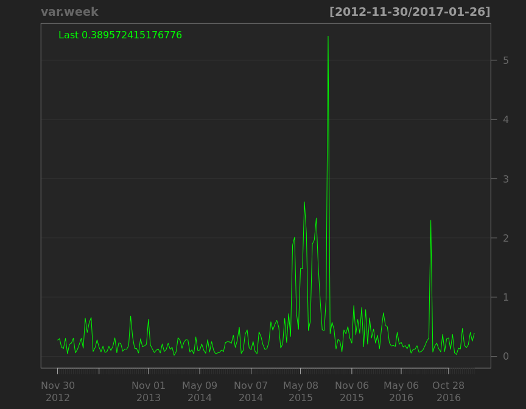

# corporation price
qiufei  
2016-01-31  

<!-- # load needed packages -->


# pic quandmod

<!-- --><!-- --><!-- --><!-- --><!-- --><!-- -->

```
##              [,1]   [,2]
## 2016-08-19 12.205 12.205
## 2016-08-26 12.205 12.205
## 2016-09-02 12.205 12.205
## 2016-09-09 12.205 12.205
## 2016-09-16 12.205 12.205
## 2016-09-23 12.205 12.205
## 2016-09-30 12.205 12.205
## 2016-10-07 12.205 12.205
## 2016-10-14 12.205 12.205
## 2016-10-21 12.205 12.205
```

# haolike

<!-- --><!-- --><!-- --><!-- -->

```
##             [,1]  [,2]
## 2016-08-19 36.08 36.56
## 2016-08-26 36.81 38.33
## 2016-09-02 36.19 37.72
## 2016-09-09 35.95 36.36
## 2016-09-16 35.94 37.14
## 2016-09-23 36.00 38.86
## 2016-09-30 34.56 35.33
## 2016-10-07 35.33 35.33
## 2016-10-14 34.11 34.90
## 2016-10-21 33.84 35.51
```


# pic quandl


```
##      Index                Close       
##  Min.   :2012-11-26   Min.   : 5.820  
##  1st Qu.:2013-11-22   1st Qu.: 8.803  
##  Median :2014-11-10   Median :11.310  
##  Mean   :2014-11-10   Mean   :12.029  
##  3rd Qu.:2015-11-03   3rd Qu.:13.060  
##  Max.   :2016-10-21   Max.   :33.620
```

<!-- --><!-- --><!-- --><!-- --><!-- --><!-- -->

```
##             [,1]  [,2]
## 2016-08-12 12.43 13.28
## 2016-08-19 13.28 18.48
## 2016-08-26 12.95 13.15
## 2016-09-02 12.95 13.35
## 2016-09-09 12.70 13.29
## 2016-09-14 13.00 13.23
## 2016-09-23 13.27 13.47
## 2016-09-30 13.06 13.80
## 2016-10-14 13.96 14.16
## 2016-10-21 13.99 14.58
```


