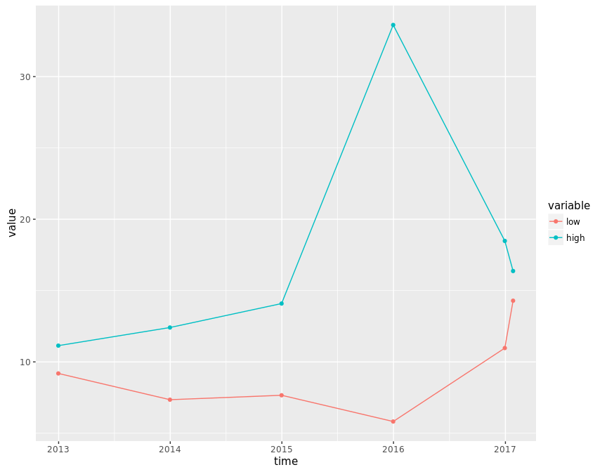

# corporation price
qiufei  
2016-01-31  

<!-- # load needed packages -->


# pic quandmod

<!-- --><!-- --><!-- --><!-- --><!-- --><!-- -->

```
##              [,1]   [,2]
## 2016-06-24 12.205 12.205
## 2016-07-01 12.205 12.205
## 2016-07-08 12.205 12.205
## 2016-07-15 12.205 12.205
## 2016-07-22 12.205 12.205
## 2016-07-29 12.205 12.205
## 2016-08-05 12.205 12.205
## 2016-08-12 12.205 12.205
## 2016-08-19 12.205 12.205
## 2016-08-23 12.205 12.205
```

# haolike

<!-- --><!-- --><!-- --><!-- -->

```
##             [,1]  [,2]
## 2016-06-24 30.45 30.64
## 2016-07-01 30.81 31.15
## 2016-07-08 31.26 32.69
## 2016-07-15 32.84 33.78
## 2016-07-22 34.40 35.61
## 2016-07-29 33.89 35.47
## 2016-08-05 35.77 36.15
## 2016-08-12 35.34 36.13
## 2016-08-19 36.08 36.56
## 2016-08-23 36.81 36.96
```


# pic quandl


```
##      Index                Close      
##  Min.   :2012-11-26   Min.   : 5.82  
##  1st Qu.:2013-11-11   1st Qu.: 8.77  
##  Median :2014-10-15   Median :11.20  
##  Mean   :2014-10-13   Mean   :11.96  
##  3rd Qu.:2015-09-18   3rd Qu.:12.84  
##  Max.   :2016-08-22   Max.   :33.62
```

<!-- --><!-- --><!-- --><!-- --><!-- --><!-- -->

```
##             [,1]  [,2]
## 2016-06-24 11.38 11.68
## 2016-07-01 11.62 12.12
## 2016-07-08 12.28 12.45
## 2016-07-15 12.27 12.47
## 2016-07-22 12.15 12.42
## 2016-07-29 11.93 12.40
## 2016-08-05 11.71 12.35
## 2016-08-12 12.43 13.28
## 2016-08-19 13.28 13.40
## 2016-08-22 13.15 13.15
```


