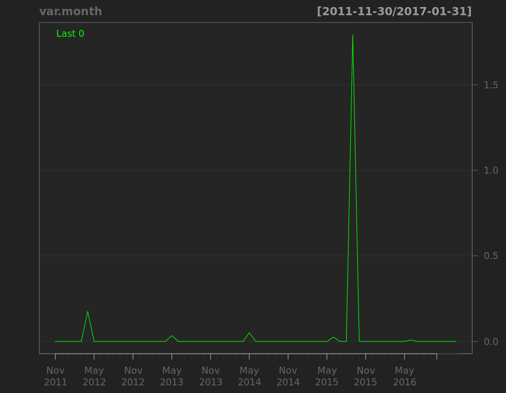

# corporation price
qiufei  
2016-01-31  

<!-- # load needed packages -->


# pic quandmod

<!-- --><!-- --><!-- --><!-- --><!-- --><!-- -->

```
##              [,1]   [,2]
## 2016-09-23 12.205 12.205
## 2016-09-30 12.205 12.205
## 2016-10-07 12.205 12.205
## 2016-10-14 12.205 12.205
## 2016-10-21 12.205 12.205
## 2016-10-28 12.205 12.205
## 2016-11-04 12.205 12.205
## 2016-11-11 12.205 12.205
## 2016-11-18 12.205 12.205
## 2016-11-22 12.205 12.205
```

# haolike

<!-- --><!-- --><!-- --><!-- -->

```
##             [,1]  [,2]
## 2016-09-23 36.00 38.86
## 2016-09-30 34.56 35.33
## 2016-10-07 35.33 35.33
## 2016-10-14 34.11 34.90
## 2016-10-21 33.84 35.51
## 2016-10-28 34.03 35.16
## 2016-11-04 33.89 34.46
## 2016-11-11 32.80 34.13
## 2016-11-18 33.44 34.06
## 2016-11-22 33.72 34.32
```


# pic quandl


```
##      Index                Close      
##  Min.   :2012-11-26   Min.   : 5.82  
##  1st Qu.:2013-11-30   1st Qu.: 8.83  
##  Median :2014-11-25   Median :11.38  
##  Mean   :2014-11-26   Mean   :12.09  
##  3rd Qu.:2015-11-25   3rd Qu.:13.24  
##  Max.   :2016-11-21   Max.   :33.62
```

<!-- --><!-- --><!-- --><!-- --><!-- --><!-- -->

```
##             [,1]  [,2]
## 2016-09-14 13.00 13.23
## 2016-09-23 13.27 13.47
## 2016-09-30 13.06 13.80
## 2016-10-14 13.96 14.16
## 2016-10-21 13.99 14.58
## 2016-10-28 14.76 15.58
## 2016-11-04 14.53 14.81
## 2016-11-11 14.33 15.30
## 2016-11-18 14.84 15.00
## 2016-11-21 14.98 14.98
```


