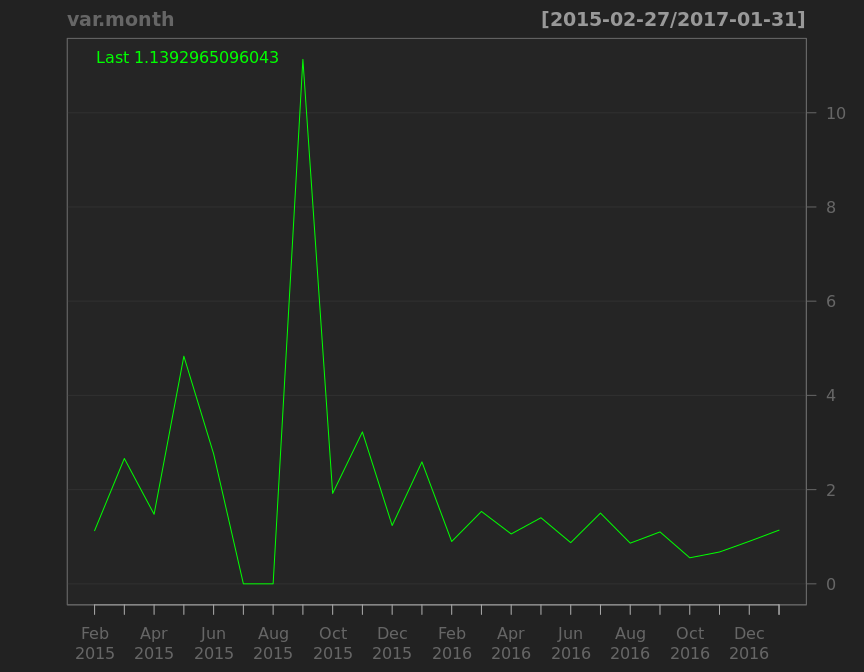

# corporation price
qiufei  
2016-01-31  

<!-- # load needed packages -->


# pic quandmod

<!-- --><!-- --><!-- --><!-- --><!-- --><!-- -->

```
##              [,1]   [,2]
## 2016-11-25 12.205 12.205
## 2016-12-02 12.205 12.205
## 2016-12-09 12.205 12.205
## 2016-12-16 12.205 12.205
## 2016-12-23 12.205 12.205
## 2016-12-30 12.205 12.205
## 2017-01-06 12.205 12.205
## 2017-01-13 12.205 12.205
## 2017-01-20 12.205 12.205
## 2017-01-27 12.205 12.205
```

# haolike

<!-- --><!-- --><!-- --><!-- -->

```
##             [,1]  [,2]
## 2016-11-25 32.60 34.32
## 2016-12-02 32.05 33.06
## 2016-12-09 32.00 33.12
## 2016-12-16 30.16 32.45
## 2016-12-23 32.54 33.30
## 2016-12-30 31.44 32.80
## 2017-01-06 32.05 32.79
## 2017-01-13 29.99 31.74
## 2017-01-20 29.01 30.05
## 2017-01-27 30.01 31.67
```


# pic quandl


```
##      Index                Close       
##  Min.   :2012-11-26   Min.   : 5.820  
##  1st Qu.:2013-12-17   1st Qu.: 8.922  
##  Median :2014-12-27   Median :11.490  
##  Mean   :2014-12-31   Mean   :12.235  
##  3rd Qu.:2016-01-14   3rd Qu.:13.623  
##  Max.   :2017-01-26   Max.   :33.620
```

<!-- --><!-- --><!-- --><!-- --><!-- --><!-- -->

```
##             [,1]  [,2]
## 2016-11-25 14.91 14.98
## 2016-12-02 14.41 14.73
## 2016-12-09 14.65 14.95
## 2016-12-16 14.85 15.96
## 2016-12-23 15.27 15.77
## 2016-12-30 15.30 15.65
## 2017-01-06 15.50 15.90
## 2017-01-13 15.41 16.37
## 2017-01-20 14.29 14.85
## 2017-01-26 14.68 15.53
```


