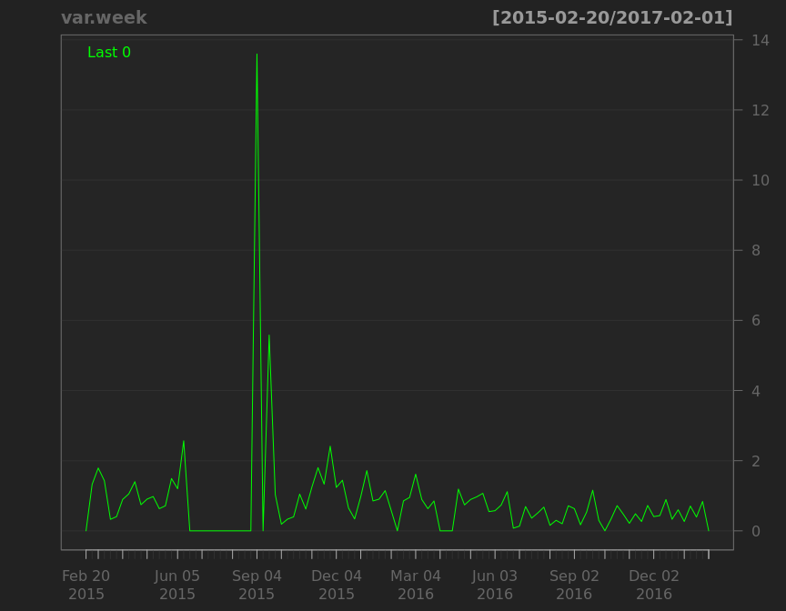
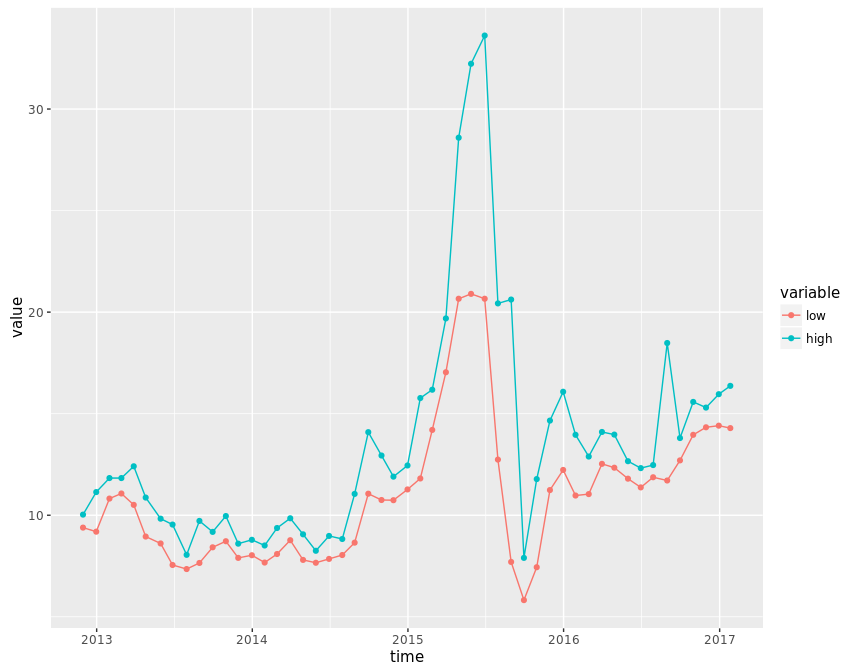

# corporation price
qiufei  
2016-01-31  

<!-- # load needed packages -->


# pic quandmod

<!-- --><!-- --><!-- --><!-- --><!-- --><!-- -->

```
##              [,1]   [,2]
## 2016-10-07 12.205 12.205
## 2016-10-14 12.205 12.205
## 2016-10-21 12.205 12.205
## 2016-10-28 12.205 12.205
## 2016-11-04 12.205 12.205
## 2016-11-11 12.205 12.205
## 2016-11-18 12.205 12.205
## 2016-11-25 12.205 12.205
## 2016-12-02 12.205 12.205
## 2016-12-08 12.205 12.205
```

# haolike

<!-- --><!-- --><!-- --><!-- -->

```
##             [,1]  [,2]
## 2016-10-07 35.33 35.33
## 2016-10-14 34.11 34.90
## 2016-10-21 33.84 35.51
## 2016-10-28 34.03 35.16
## 2016-11-04 33.89 34.46
## 2016-11-11 32.80 34.13
## 2016-11-18 33.44 34.06
## 2016-11-25 32.60 34.32
## 2016-12-02 32.05 33.06
## 2016-12-08 32.00 33.12
```


# pic quandl


```
##      Index                Close      
##  Min.   :2012-11-26   Min.   : 5.82  
##  1st Qu.:2013-12-04   1st Qu.: 8.84  
##  Median :2014-12-03   Median :11.41  
##  Mean   :2014-12-05   Mean   :12.12  
##  3rd Qu.:2015-12-08   3rd Qu.:13.29  
##  Max.   :2016-12-07   Max.   :33.62
```

<!-- --><!-- --><!-- --><!-- --><!-- --><!-- -->

```
##             [,1]  [,2]
## 2016-09-30 13.06 13.80
## 2016-10-14 13.96 14.16
## 2016-10-21 13.99 14.58
## 2016-10-28 14.76 15.58
## 2016-11-04 14.53 14.81
## 2016-11-11 14.33 15.30
## 2016-11-18 14.84 15.00
## 2016-11-25 14.91 14.98
## 2016-12-02 14.41 14.73
## 2016-12-07 14.65 14.83
```


