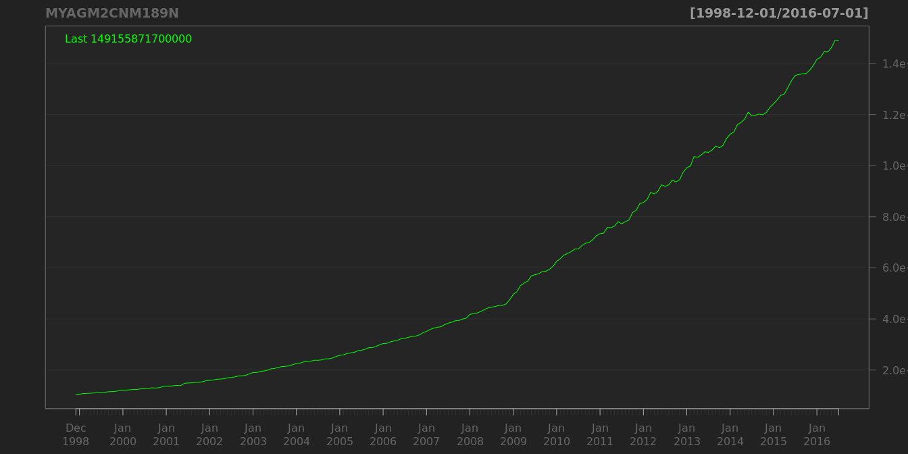
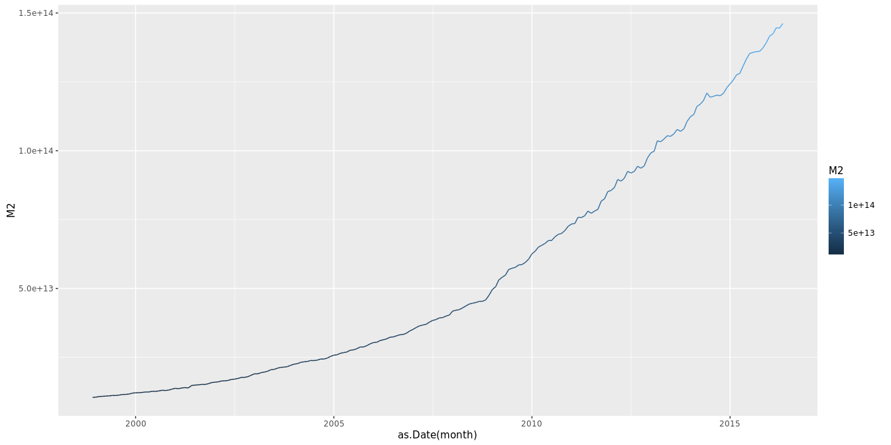
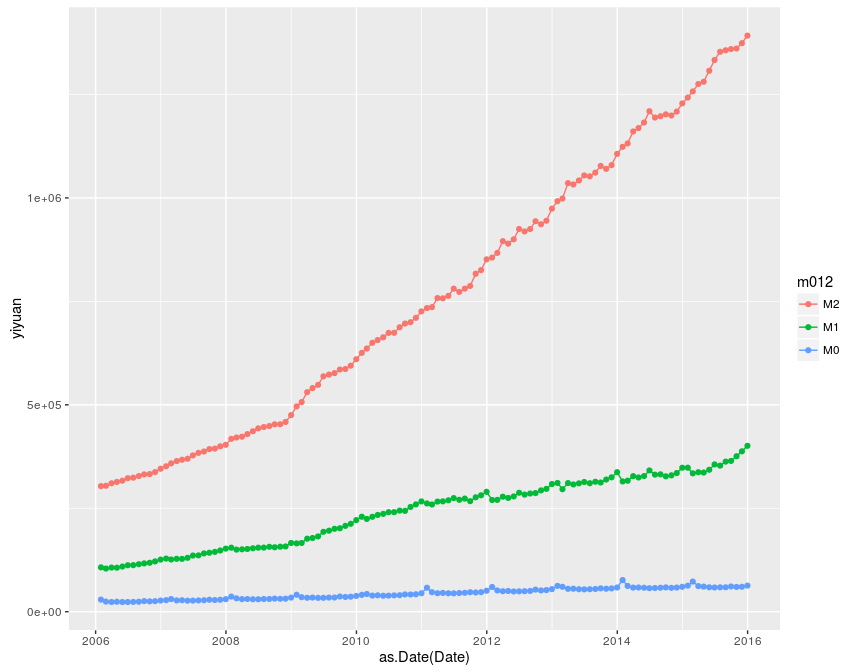

# finance
qiufei  
August 21, 2015  

fiance about china


# load library


```r
library(quantmod)
library(ggplot2)
library(reshape2)
library(Quandl)
```


# M2 for China

Monthly, Not Seasonally Adjusted

## quandmod plot


```r
getSymbols('MYAGM2CNM189N',src='FRED')
```

```
## [1] "MYAGM2CNM189N"
```

```r
chartSeries(MYAGM2CNM189N)
```



## quandmod plot with name specified by yourself

```r
chartSeries(MYAGM2CNM189N,name="China M2 in CNY")
```


## ggplot2 plot


```r
cnm2=data.frame(month=time(MYAGM2CNM189N),M2=coredata(MYAGM2CNM189N))
colnames(cnm2)=c('month','M2')
ggplot(data=cnm2,aes(x=as.Date(month),y=M2,color=M2))+geom_line()
```



# m0,m1,m2


```r
money=Quandl("PBCHINA/REP_07", authcode="9iGeZZoG6Vc46rfs1AgJ")
money3=melt(data=money,id.vars = 'Date',variable.name = 'm012',value.name = 'yiyuan')

ggplot(data=money3,aes(x=as.Date(Date),y=yiyuan,color=m012))+geom_line()+geom_point()
```




