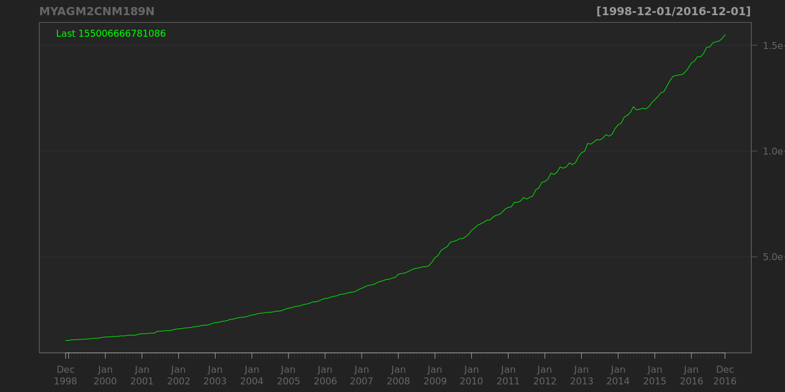
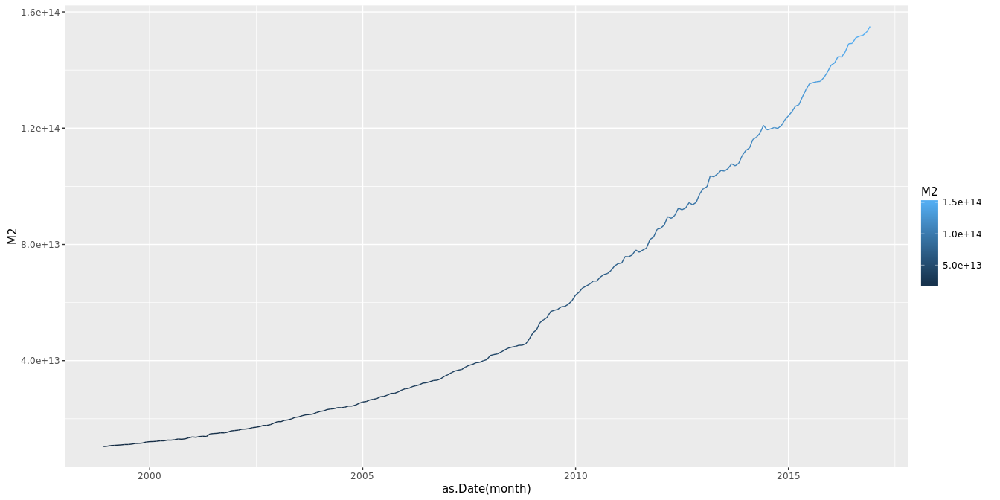
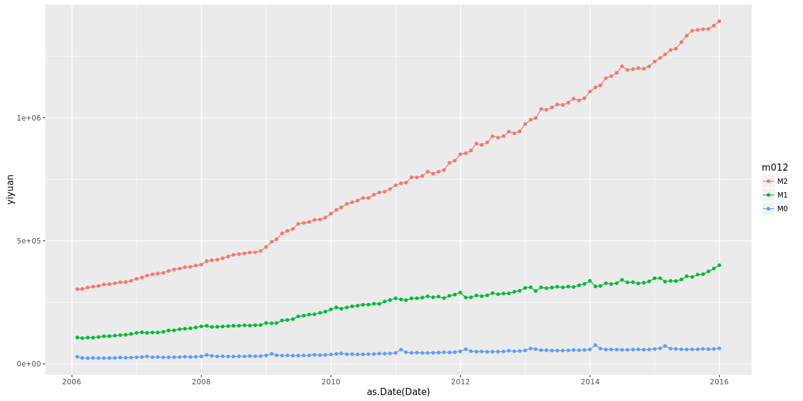

# finance
qiufei  
August 21, 2015  

fiance about china


# load library


```r
library(knitr)
opts_chunk$set(Message=FALSE,echo=FALSE,fig.align = 'center')
library(quantmod)
library(ggplot2)
library(reshape2)
library(Quandl)
```


# M2 for China

Monthly, Not Seasonally Adjusted

## quandmod plot


```
## [1] "MYAGM2CNM189N"
```



## quandmod plot with name specified by yourself


## ggplot2 plot



# m0,m1,m2




