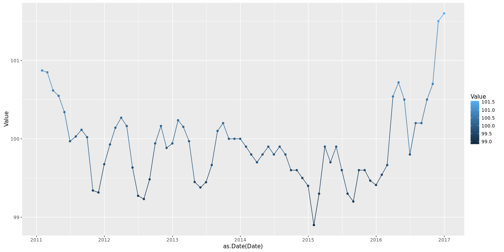
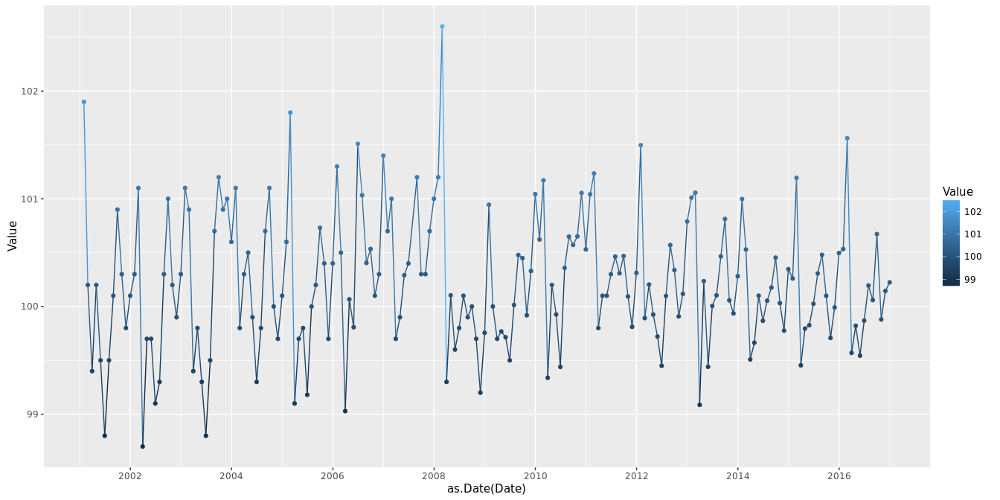
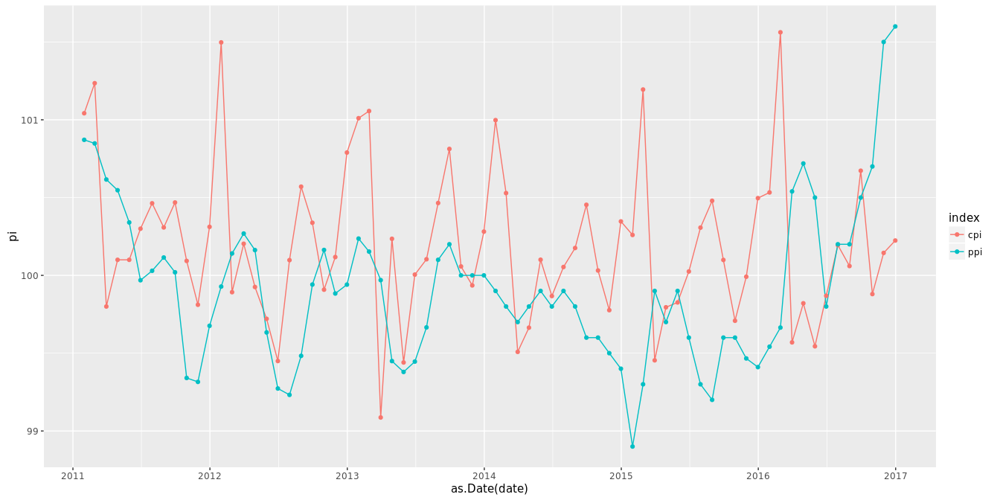

# price
qiufei  
August 21, 2015  

I want to see the difference between ppi and cpi of china.


# load needed packages


```r
library(knitr)
opts_chunk$set(Message=FALSE,echo=FALSE,fig.align = 'center')
library(ggplot2)
library(reshape2)
library(Quandl)
```

the ppi and cpi data are preceding month=100.

# get ppi data


# plot ppi



# get cpi data


# plot cpi


# merge cpi and ppi


#plot cpi and ppi in one figure



