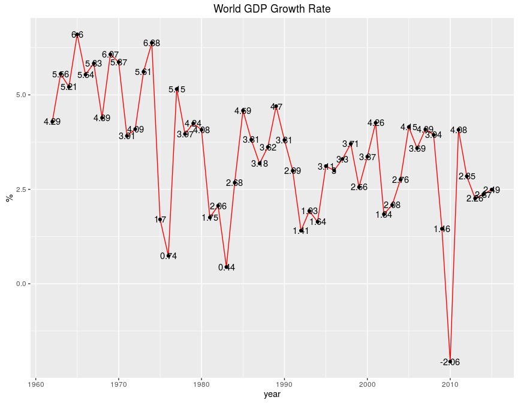
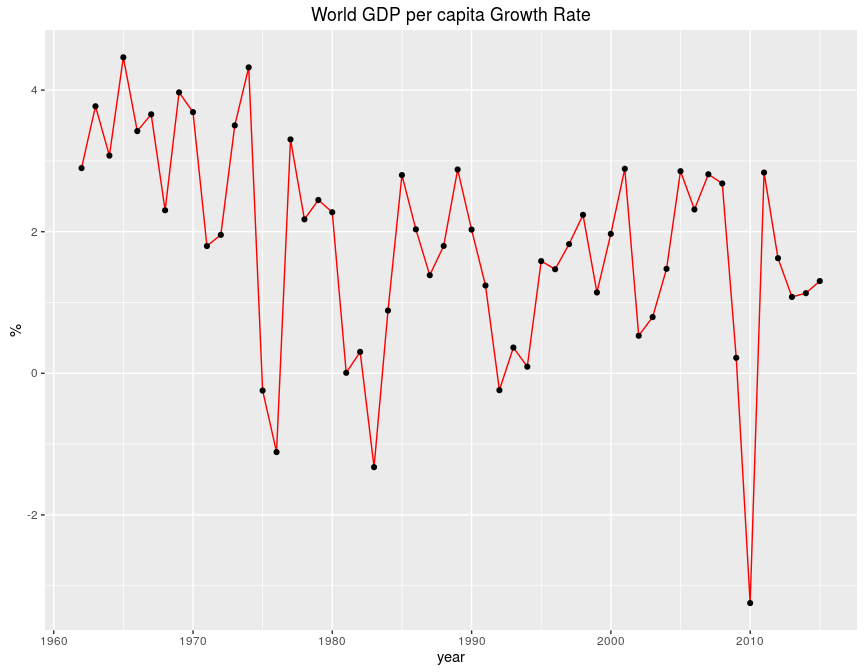
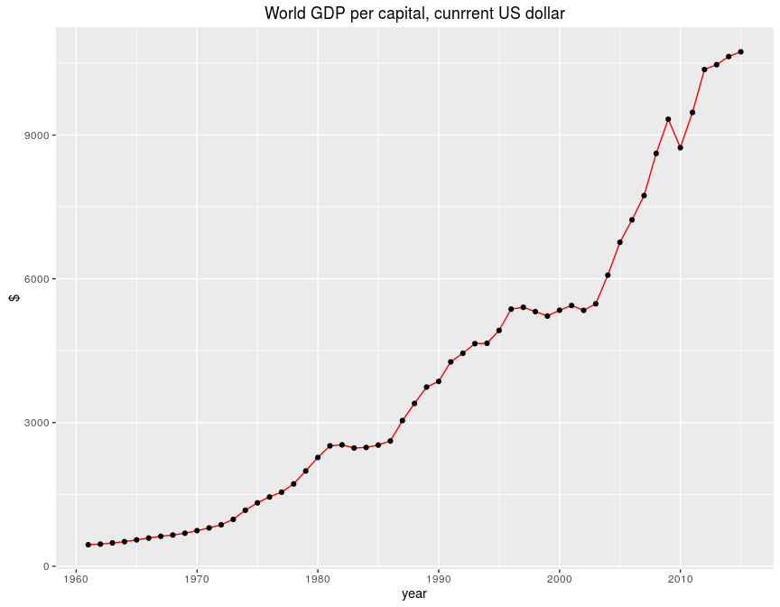
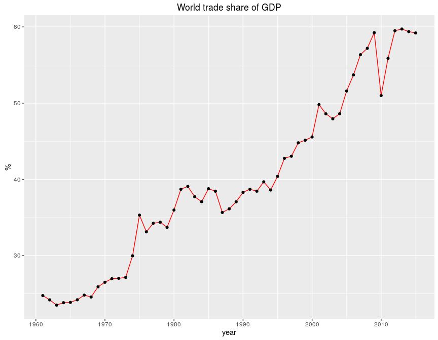

# 世界经济
qiufei  
2016-01-31  

# world gdp #

## world gdp growth rate ##

2014-12-31年世界GDP增长率为2.49

1961-12-31年以来,世界GDP增速的中位数为3.66,均值为3.46

## china gdp growth rate ##

2014-12-31年中国GDP增长率为7.27

1978-12-31年以来,中国GDP增速的中位数为9.49,均值为9.81

##  world gdp per capita growth rate ##

2014-12-31年世界人均GDP增长率为1.3

世界人均GDP增速的中位数为1.96,均值为1.8

## world gdp per capita current price ##

2014-12-31年世界人均GDP为1.07\times 10^{4}美元(现价).

不考虑通胀因素,世界人均GDP2014-12-31是1978-12-31的5.4倍.

## china gdp per capita current price ##

2014-12-31年中国人均GDP为4.66\times 10^{4}元(现价).

不考虑通胀因素,中国人均GDP2014-12-31是1978-12-31的122.14倍.

## world GDP per capita constant price ##

2014-01-01年世界不变价人均GDP为8010.8美元(1960年不变价).

不变价世界人均GDP2014-01-01是1978-01-01的1.61倍.

基本上人均GDP的绝对值出现下降的年份都是危机的年份.

## china GDP per capita constant price ##

2014-01-01年中国不变价人均GDP为3862.92元.

中国不变价人均GDP2014-01-01是1978-01-01的19.79倍.

# trade #

2014-12-31世界贸易占GDP的比重为59.21

世界贸易占GDP比重的中位数为38.45,均值为39.56
