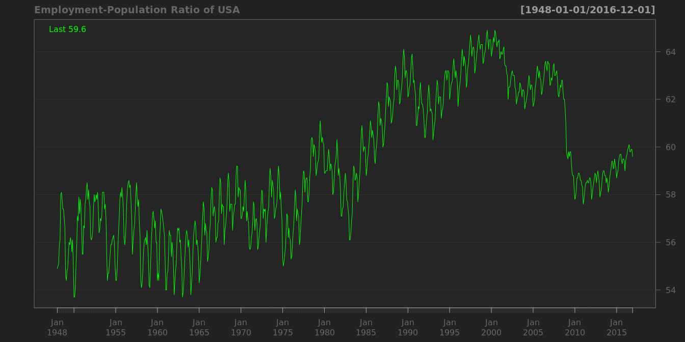
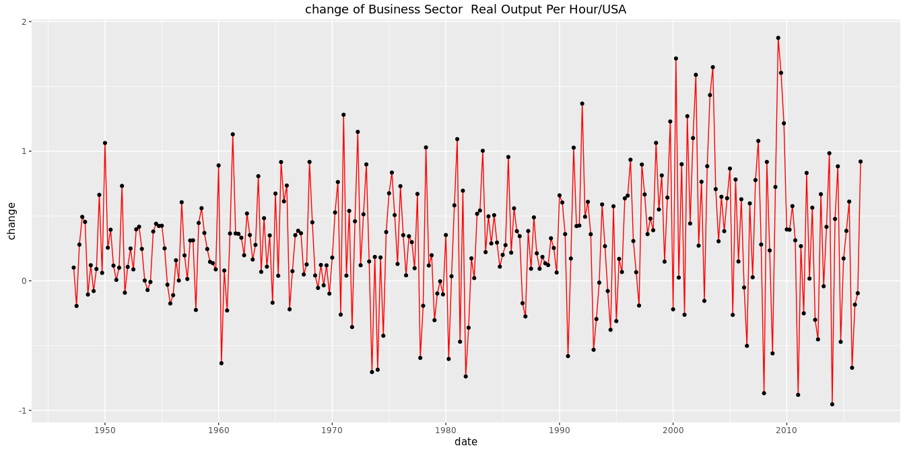
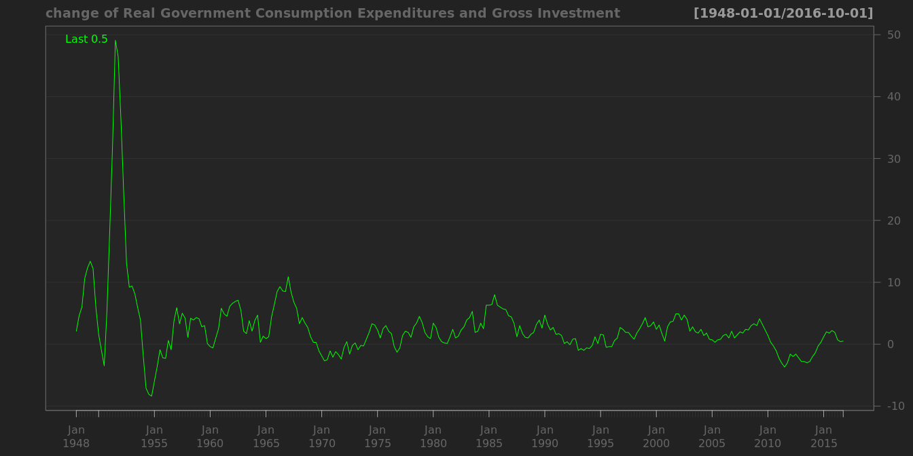
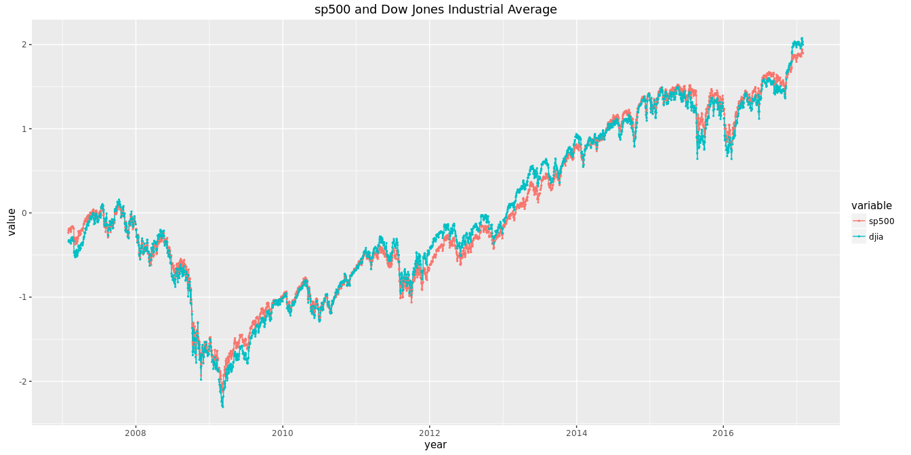
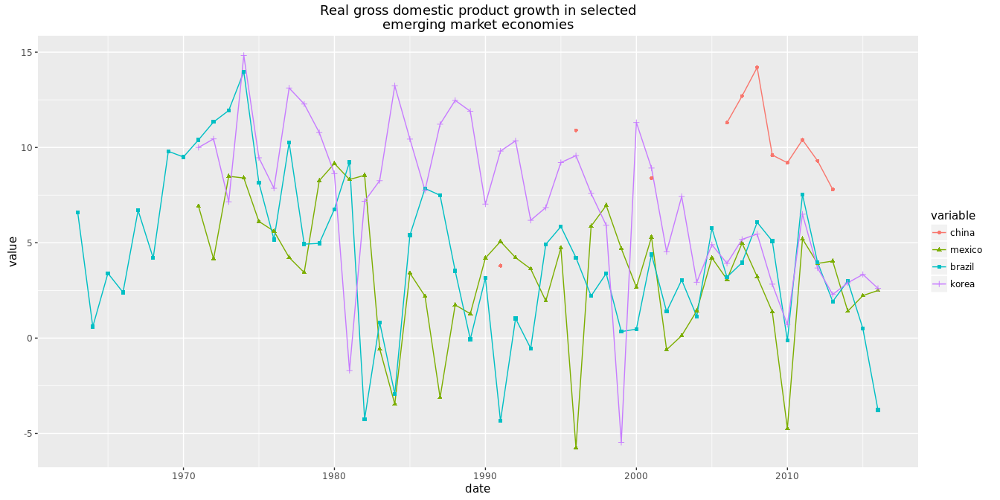

# 中央银行报告
qiufei  
2016-05-19  


this is report of major central banks.

# The labor market

Labor market conditions strengthened further across a variety of dimensions over the second half of 2015.

## employment numbers ##


## employment rate ##

Changing demographics--most notably the increasing share of older people in the population, who are less likely to be in the labor force--and other longer-run structural changes in the labor market have continued to push down the participation rate even as cyclical forces have been pushing it up.

That said, labor force participation appears to remain a little weaker than can be explained by structural factors alone, pointing to the likelihood that some slack remains in this dimension of labor utilization.

In addition, although the share of workers who are employed part time but would like to work full time has fallen noticeably since June, it is still relatively high, indicating some scope for improvement on this dimension as well.



```
##      Index             LNU02300000   
##  Min.   :1948-01-01   Min.   :53.70  
##  1st Qu.:1965-02-22   1st Qu.:56.90  
##  Median :1982-04-16   Median :58.70  
##  Mean   :1982-04-16   Mean   :59.21  
##  3rd Qu.:1999-06-08   3rd Qu.:62.02  
##  Max.   :2016-08-01   Max.   :64.90
```


## labor compensation ##

compensation per hour in the business sector--a volatile measure derived from the labor compensation data in the national income and product accounts, or NIPA--is reported to have increased more quickly in 2015 than its average pace throughout most of the recovery.

the employment cost index for private industry workers, which measures both wages and the cost to employers of providing benefits, increased about 2 percent over the 12 months ending in December, similar to the pace seen throughout most of the recovery. All of these measures of compensation are increasing at slower rates than those seen prior to the recession.

This deceleration probably reflects a variety of factors, including the slower growth of productivity, the slower pace of inflation, and perhaps some remaining slack in the labor market. 


## labor productivity ##



```
##           date   value change
## 263 2012-07-01 104.131 -0.301
## 264 2012-10-01 103.679 -0.452
## 265 2013-01-01 104.347  0.668
## 266 2013-04-01 104.305 -0.042
## 267 2013-07-01 104.721  0.416
## 268 2013-10-01 105.705  0.984
## 269 2014-01-01 104.752 -0.953
## 270 2014-04-01 105.229  0.477
## 271 2014-07-01 106.112  0.883
## 272 2014-10-01 105.641 -0.471
## 273 2015-01-01 105.813  0.172
## 274 2015-04-01 106.198  0.385
## 275 2015-07-01 106.809  0.611
## 276 2015-10-01 106.138 -0.671
## 277 2016-01-01 105.954 -0.184
## 278 2016-04-01 105.750 -0.204
```

```
##    Min. 1st Qu.  Median    Mean 3rd Qu.    Max.    NA's 
## -0.9530  0.0390  0.2880  0.3042  0.5760  1.8740       1
```

从这里来看,美国的劳动生产率并没有下降很多啊?为什么美国人都在讨论劳动生产率下降的问题?

# prices #


## oil prices ##

Futures prices have also dropped significantly and indicate that market participants expect only modest price increases over the next few years. 


```
## [1] 52.32
```

```
##            DCOILBRENTEU
## 2016-09-06        46.21
```


## cpi ##


## exchange rate ##

The broad dollar has appreciated more than 20 percent since the middle of 2014, reflecting both heightened concerns about the global outlook, which have resulted in safe-haven flows toward dollar asset


# GDP #

## Quarterly Percent Change from Preceding Period  ##

Quarterly, Seasonally Adjusted Annual Rate


## Quarterly Percent Change from Quarter One Year Ago  ##

Quarterly, Seasonally Adjusted


```
##            A191RO1Q156NBEA
## 2015-01-01             3.3
## 2015-04-01             3.0
## 2015-07-01             2.2
## 2015-10-01             1.9
## 2016-01-01             1.6
## 2016-04-01             1.2
```

## annually Percent Change from Preceding Period  ##

Annual, Not Seasonally Adjusted


```
##            A191RL1A225NBEA
## 2010-01-01             2.5
## 2011-01-01             1.6
## 2012-01-01             2.2
## 2013-01-01             1.7
## 2014-01-01             2.4
## 2015-01-01             2.6
```

http://www.federalreserve.gov/monetarypolicy/mpr_20160210_part1.htm


# house #

## 房价 ##


# 债务占可支配收入的比重 #

也就是说在顶峰时期,美国家庭债务支出占可支配收入的比重不超过20%?


# investment #

## Real Private Nonresidential Fixed Investment ##

Billions of Chained 2009 Dollars


# fiscal policy #

## Percent Change from Preceding Period ##

Quarterly, Seasonally Adjusted Annual Rate.


```
##                                                             
## "Min.   :-12.900  " "1st Qu.: -0.900  " "Median :  2.000  " 
##                                                             
## "Mean   :  2.881  " "3rd Qu.:  4.900  " "Max.   : 64.800  "
```


## Percent Change from Quarter One Year Ago  ##
Percent Change from Quarter One Year Ago.
Quarterly, Seasonally Adjusted.


```
##                                                          
## "Min.   :-8.400  " "1st Qu.: 0.300  " "Median : 1.900  " 
##                                                          
## "Mean   : 2.807  " "3rd Qu.: 3.900  " "Max.   :49.100  "
```



## surplus ##


# trade #

## growth rate ##


## current account percent ##


```
##                                                          
## "Min.   :-5.822  " "1st Qu.:-3.693  " "Median :-2.751  " 
##                                                          
## "Mean   :-2.711  " "3rd Qu.:-1.642  " "Max.   : 0.157  "
```


# financial developments #


## Effective Federal Funds Rate ##


```
##                                                          
## "Min.   : 0.070  " "1st Qu.: 2.480  " "Median : 4.735  " 
##                                                          
## "Mean   : 4.946  " "3rd Qu.: 6.603  " "Max.   :19.100  "
```


## bond ##

### USA Treasury Inflation-Indexed Security ##

Long-Term Government Bond Yields


```
##                                                             
## "Min.   :-0.7700  " "1st Qu.: 0.4575  " "Median : 1.4150  " 
##                                                             
## "Mean   : 1.1784  " "3rd Qu.: 1.9175  " "Max.   : 2.8900  "
```


```
##                                                          
## "Min.   :-0.250  " "1st Qu.: 0.895  " "Median : 2.170  " 
##                                                          
## "Mean   : 2.077  " "3rd Qu.: 2.895  " "Max.   : 4.340  "
```


### 'Moody Seasoned Aaa Corporate Bond Yield ##

```
##                                                          
## "Min.   : 2.460  " "1st Qu.: 3.785  " "Median : 5.080  " 
##                                                          
## "Mean   : 5.796  " "3rd Qu.: 7.442  " "Max.   :15.490  "
```


### Moody's Seasoned Aaa Corporate Bond Yield Relative to Yield on 10-Year Treasury Constant Maturity ##


```
##                                                             
## "Min.   :-0.1700  " "1st Qu.: 0.4200  " "Median : 0.8100  " 
##                                                             
## "Mean   : 0.9117  " "3rd Qu.: 1.3600  " "Max.   : 2.6800  "
```


## risk spread ##

### St. Louis Fed Financial Stress Index ##


```
##                                                                   
## "Min.   :-1.660000  " "1st Qu.:-0.720000  " "Median : 0.098500  " 
##                                                                   
## "Mean   : 0.000005  " "3rd Qu.: 0.605000  " "Max.   : 5.631000  "
```


### CBOE volatility index ##

in the short run, there is a strong negative correlation between volatility index and the level of the market.


```
##                                                                         
## "Min.   : 9.31  " "1st Qu.:14.05  " "Median :17.88  " "Mean   :19.74  " 
##                                                       
## "3rd Qu.:23.12  " "Max.   :80.86  "   "NA's   :240  "
```


```
##                                                          
## "Min.   :  8.51  " "1st Qu.: 14.36  " "Median : 18.65  " 
##                                                          
## "Mean   : 20.56  " "3rd Qu.: 24.11  " "Max.   :150.19  " 
##                    
##    "NA's   :278  "
```


### BofA Merrill Lynch US Corporate AAA Option-Adjusted Spread ##


```
##                                                          
## "Min.   :0.1900  " "1st Qu.:0.6000  " "Median :0.7000  " 
##                                                          
## "Mean   :0.8335  " "3rd Qu.:0.8600  " "Max.   :6.0700  " 
##                    
##      "NA's   :5  "
```


### BofA Merrill Lynch US High Yield CCC or Below Option-Adjusted Spread ##


```
##                                                          
## "Min.   : 4.140  " "1st Qu.: 7.688  " "Median :10.310  " 
##                                                          
## "Mean   :11.843  " "3rd Qu.:13.840  " "Max.   :44.290  " 
##                    
##      "NA's   :5  "
```


## stock market ##

1. historically stocks have returned between 6 and 7 percent after inflation over the last two centuries and have sold at an average PE ratio of about 15.

### country stock market comparison ###


### s&p ##

of the top 20 firms,15 belongs to two industries: consumer staples and healthcare.


```
##                                                          
## "Min.   : 676.5  " "1st Qu.:1224.9  " "Median :1410.6  " 
##                                                          
## "Mean   :1491.1  " "3rd Qu.:1848.9  " "Max.   :2190.2  " 
##                    
##     "NA's   :92  "
```


### Dow Jones Industrial Average ##


```
##                                                                         
## "Min.   : 6547  " "1st Qu.:11410  " "Median :12914  " "Mean   :13413  " 
##                                                       
## "3rd Qu.:16204  " "Max.   :18636  "    "NA's   :92  "
```


### sp and dow in one pic ###




## credit ##


### credit world comparison ###

Private Credit by Deposit Money Banks and Other Financial Institutions to GDP.


浅绿色柱状带标出的是2007,2008两年间的数据.

1. 中国信贷占GDP的比重不是最高的.
最上面蓝色与红色分别是日本和美国的数据,可以看到美国信贷占GDP的比重在2008年达到最大,也是在这一年,次贷危机全面爆发.

从这里我们易于得出当信贷占GDP的比重达到高点时,会爆发金融危机的结论.比如美国2001年也到达一个高点,那一年附近美国互联网泡沫破灭.
但是日本前一个高点在1998,1999年附近,那两年似乎日本没有什么大的的危机发生?

2. 中国在2008年后开始高速加杠杆
中间绿色和棕色分别是中国和德国的数据,中贷款占GDP的比重与德国的水平相似,并且这两个国家的共同特点是当美日这一指标在2007年达到高点时,中德两国达到低点.
中国尤其特殊的地方是,当2008年后美德日三国都开始去杠杆的时候(表现为这一指标的下降),中国开始高速加杠杆,指标值快速上升.

3. 目前世界的信贷占GDP的比重处在历史上的最高水平.

世界1984-2005之间,世界总体的信贷占GDP的比重是比较平稳的,此后一直上升.

一个疑问:中国信贷占GDP的比重在2003年达到过一个高点,不知道那一年发生了什么?


# monetary policy divergence #




# usa monetary policy #


