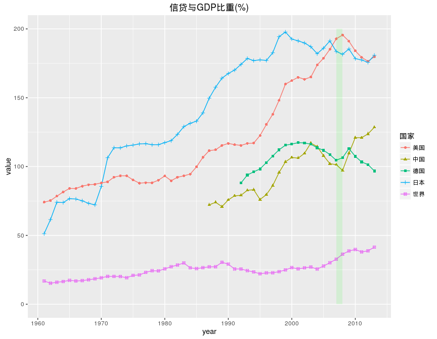

# 信贷占GDP比重国际比较
qiufei  
2016-05-18  

一直以来,中国信贷占GDP的比重价高,这被认为是中国金融低效率的表现.

但是,从各国信贷占GDP的比重这一指标的比较来看,中国的信贷占GDP的比重不是最高的.

图中包括美国,日本,德国,中国,和世界整体的数据.浅绿色柱状带标出的是2007,2008两年间的数据.

1. 中国信贷占GDP的比重不是最高的.

最上面蓝色与红色分别是日本和美国的数据,可以看到美国信贷占GDP的比重在2008年达到最大,也是在这一年,次贷危机全面爆发.

>从这里我们易于得出当信贷占GDP的比重达到高点时,会爆发金融危机的结论.比如美国2001年也到达一个高点,那一年附近美国互联网泡沫破灭.
>但是日本前一个高点在1998,1999年附近,那两年似乎日本没有什么大的的危机发生?

2. 中国在2008年后开始高速加杠杆

中间绿色和棕色分别是中国和德国的数据,中贷款占GDP的比重与德国的水平相似,并且这两个国家的共同特点是当美日这一指标在2007年达到高点时,中德两国达到低点.

中国尤其特殊的地方是,当2008年后美德日三国都开始去杠杆的时候(表现为这一指标的下降),中国开始高速加杠杆,指标值快速上升.

3. 目前世界的信贷占GDP的比重处在历史上的最高水平.

世界1984-2005之间,世界总体的信贷占GDP的比重是比较平稳的,此后一直上升.

> 一个疑问:中国信贷占GDP的比重在2003年达到过一个高点,不知道那一年发生了什么?

---

数据来源:https://research.stlouisfed.org/fred2/

指标:Private Credit by Deposit Money Banks and Other Financial Institutions to GDP

