# 市场观测指标
qiufei  
2016-03-4  


# risk and volatility #

## St. Louis Fed Financial Stress Index ##


```
##                                                                   
## "Min.   :-1.655000  " "1st Qu.:-0.730750  " "Median : 0.024500  " 
##                                                                   
## "Mean   :-0.000007  " "3rd Qu.: 0.643750  " "Max.   : 5.493000  "
```

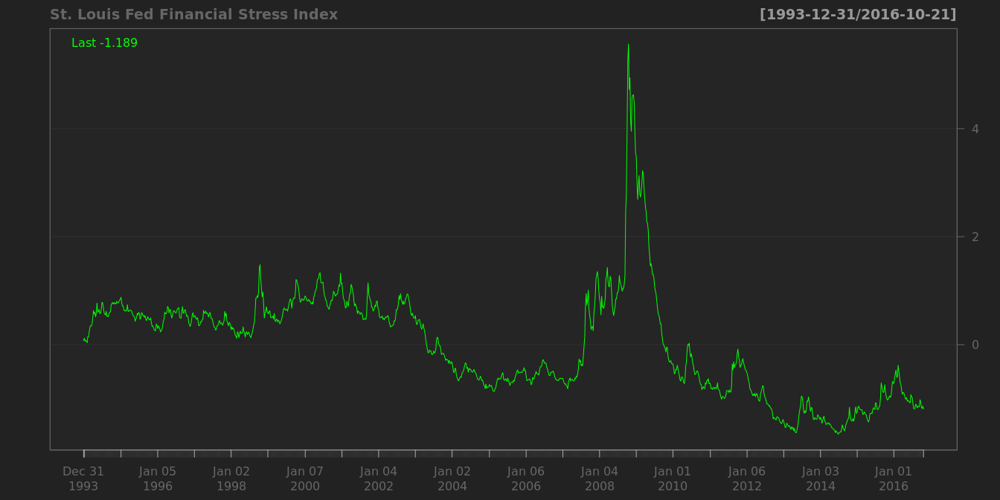


## CBOE volatility index ##

in the short run, there is a strong negative correlation between volatility index and the level of the market.


```
##                                                                         
## "Min.   : 9.31  " "1st Qu.:13.99  " "Median :17.80  " "Mean   :19.66  " 
##                                                       
## "3rd Qu.:23.05  " "Max.   :80.86  "   "NA's   :243  "
```

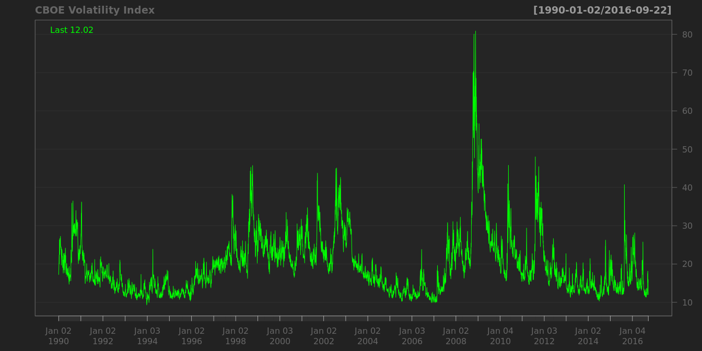

```
##                                                          
## "Min.   :  8.51  " "1st Qu.: 14.27  " "Median : 18.57  " 
##                                                          
## "Mean   : 20.49  " "3rd Qu.: 24.02  " "Max.   :150.19  " 
##                    
##    "NA's   :281  "
```

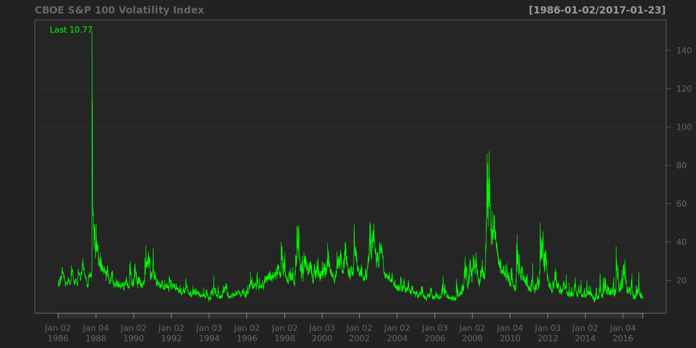


## BofA Merrill Lynch US Corporate AAA Option-Adjusted Spread ##


```
##                                                          
## "Min.   :0.1900  " "1st Qu.:0.6000  " "Median :0.7000  " 
##                                                          
## "Mean   :0.8325  " "3rd Qu.:0.8500  " "Max.   :6.0700  " 
##                    
##      "NA's   :5  "
```

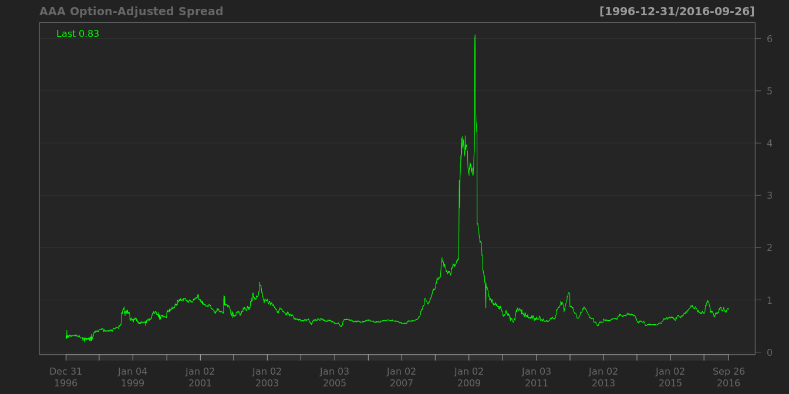

## BofA Merrill Lynch US High Yield CCC or Below Option-Adjusted Spread ##


```
##                                                                         
## "Min.   : 4.14  " "1st Qu.: 7.72  " "Median :10.39  " "Mean   :11.83  " 
##                                                       
## "3rd Qu.:13.80  " "Max.   :44.29  "     "NA's   :5  "
```

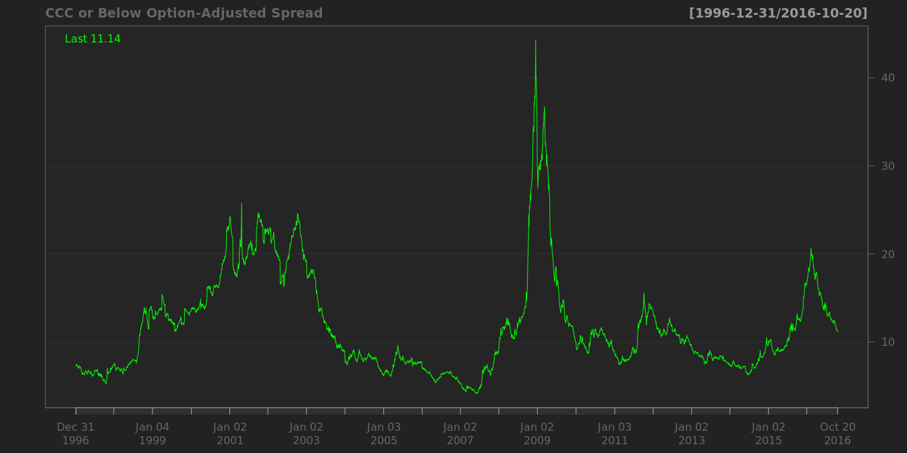


# interest rates #

Long-Term Government Bond Yields

## USA Treasury Inflation-Indexed Security ##


```
##                                                             
## "Min.   :-0.7700  " "1st Qu.: 0.4175  " "Median : 1.3650  " 
##                                                             
## "Mean   : 1.1569  " "3rd Qu.: 1.9100  " "Max.   : 2.8900  "
```

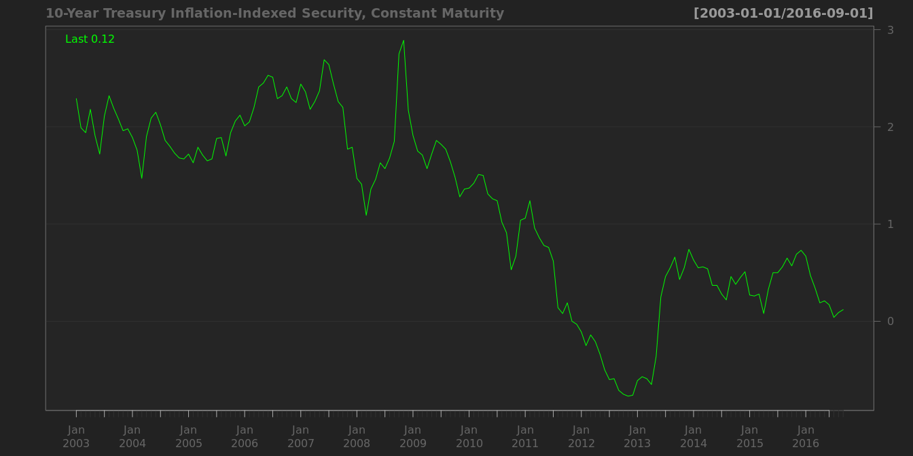

```
##                                                          
## "Min.   :-0.250  " "1st Qu.: 0.860  " "Median : 2.140  " 
##                                                          
## "Mean   : 2.048  " "3rd Qu.: 2.860  " "Max.   : 4.340  "
```

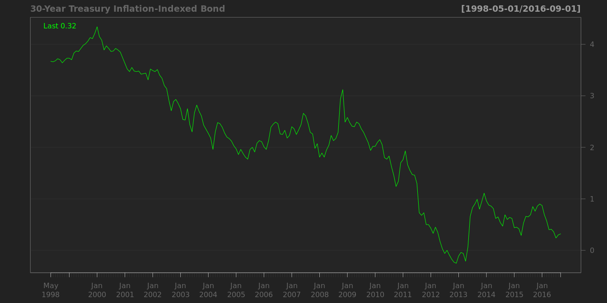

## 'Moody Seasoned Aaa Corporate Bond Yield ##

```
##                                                          
## "Min.   : 2.460  " "1st Qu.: 3.770  " "Median : 5.080  " 
##                                                          
## "Mean   : 5.794  " "3rd Qu.: 7.440  " "Max.   :15.490  "
```

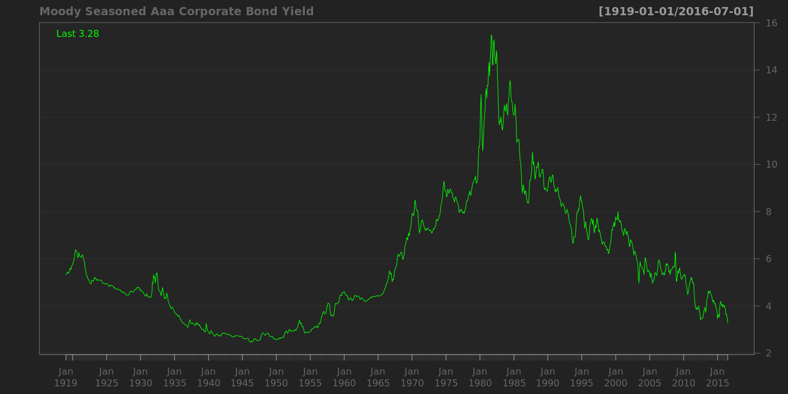

## Moody's Seasoned Aaa Corporate Bond Yield Relative to Yield on 10-Year Treasury Constant Maturity ##


```
##                                                             
## "Min.   :-0.1700  " "1st Qu.: 0.4200  " "Median : 0.8100  " 
##                                                             
## "Mean   : 0.9128  " "3rd Qu.: 1.3600  " "Max.   : 2.6800  "
```

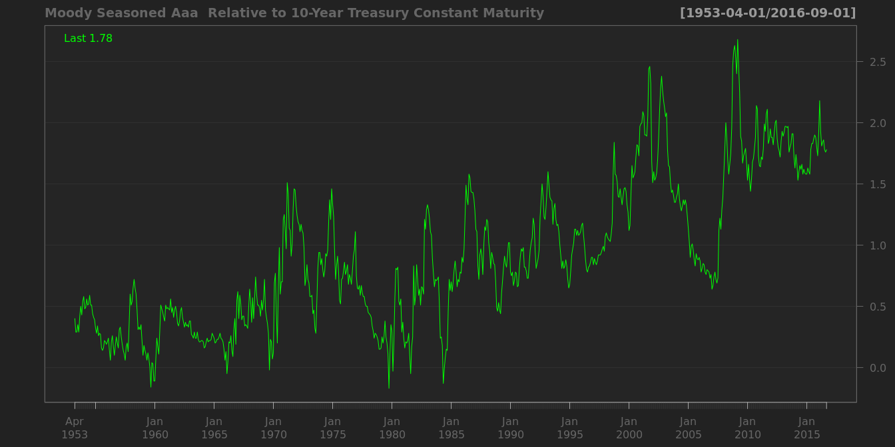


## Effective Federal Funds Rate ##


```
##                                                          
## "Min.   : 0.070  " "1st Qu.: 2.442  " "Median : 4.720  " 
##                                                          
## "Mean   : 4.922  " "3rd Qu.: 6.580  " "Max.   :19.100  "
```

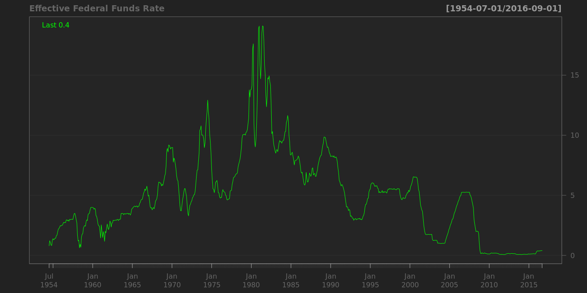


# stock markets #

1. historically stocks have returned between 6 and 7 percent after inflation over the last two centuries and have sold at an average PE ratio of about 15.


## s&p ##

of the top 20 firms,15 belongs to two industries: consumer staples and healthcare.


```
##                                                          
## "Min.   : 676.5  " "1st Qu.:1225.2  " "Median :1431.3  " 
##                                                          
## "Mean   :1519.3  " "3rd Qu.:1917.8  " "Max.   :2277.0  " 
##                    
##     "NA's   :91  "
```

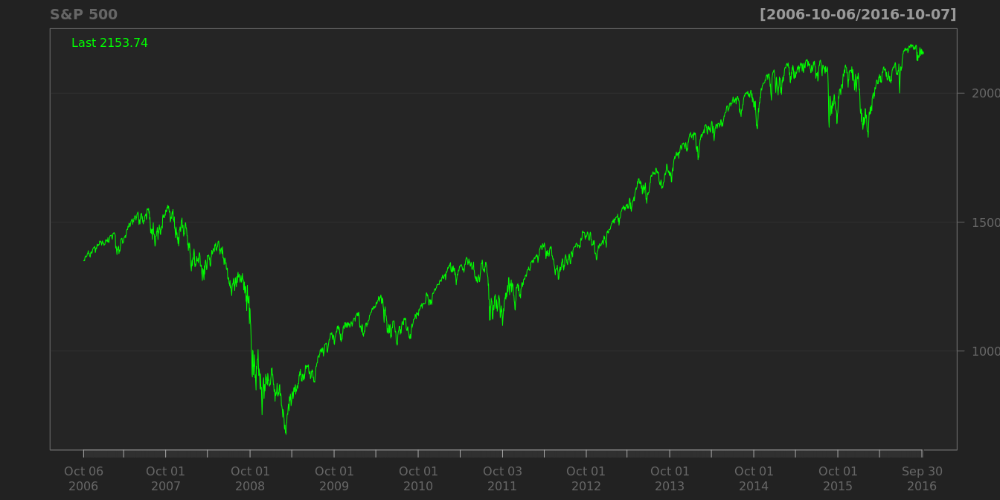


## Dow Jones Industrial Average ##


```
##                                                                         
## "Min.   : 6547  " "1st Qu.:11412  " "Median :13107  " "Mean   :13643  " 
##                                                       
## "3rd Qu.:16481  " "Max.   :19975  "    "NA's   :91  "
```

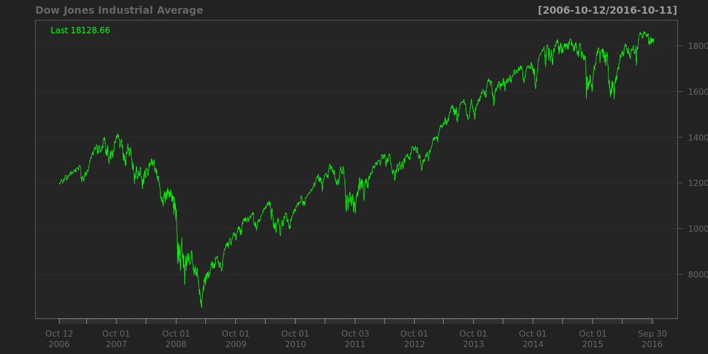

simpic.q('BCB/UDJIAD1','Dow Jones Industrial Average since 1896')


# real estate #

## USA home price ##


 

```
##                                                          
## "Min.   : 25.25  " "1st Qu.: 55.82  " "Median : 81.67  " 
##                                                          
## "Mean   : 97.94  " "3rd Qu.:144.06  " "Max.   :185.06  "
```

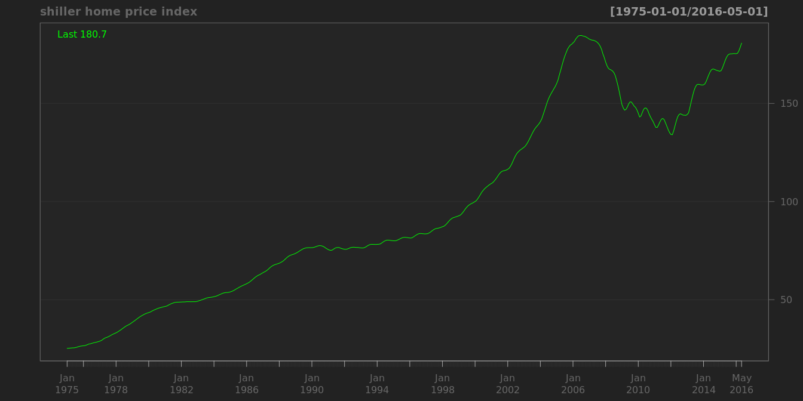
 Index Jan 2000=100

