# risk and volatility #

## St. Louis Fed Financial Stress Index ##


```
##                                                                   
## "Min.   :-1.658000  " "1st Qu.:-0.713000  " "Median : 0.092500  " 
##                                                                   
## "Mean   : 0.000016  " "3rd Qu.: 0.588250  " "Max.   : 5.673000  "
```

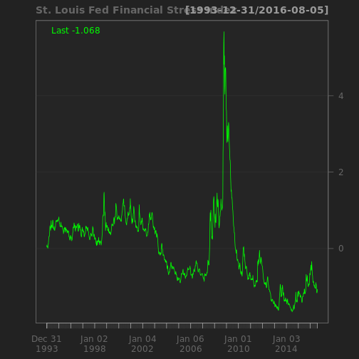


## CBOE volatility index ##

in the short run, there is a strong negative correlation between volatility index and the level of the market.


```
##                                                                         
## "Min.   : 9.31  " "1st Qu.:14.08  " "Median :17.91  " "Mean   :19.76  " 
##                                                       
## "3rd Qu.:23.15  " "Max.   :80.86  "   "NA's   :239  "
```

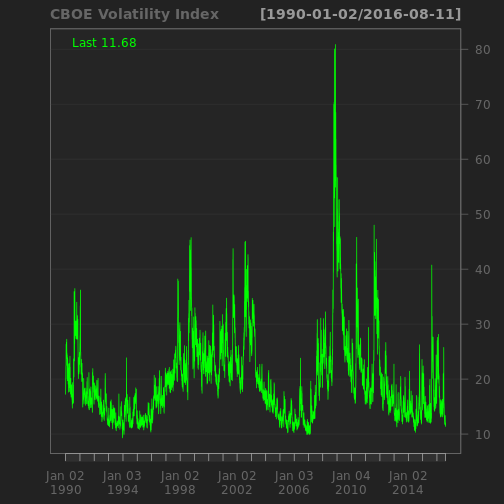

```
##                                                          
## "Min.   :  8.51  " "1st Qu.: 14.39  " "Median : 18.68  " 
##                                                          
## "Mean   : 20.59  " "3rd Qu.: 24.14  " "Max.   :150.19  " 
##                    
##    "NA's   :277  "
```

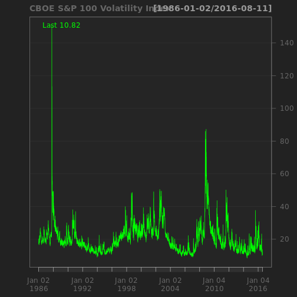


## BofA Merrill Lynch US Corporate AAA Option-Adjusted Spread ##


```
##                                                          
## "Min.   :0.1900  " "1st Qu.:0.6000  " "Median :0.7000  " 
##                                                          
## "Mean   :0.8337  " "3rd Qu.:0.8600  " "Max.   :6.0700  " 
##                    
##      "NA's   :5  "
```

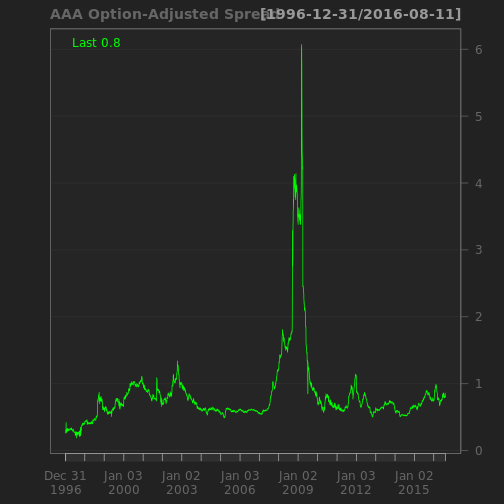

## BofA Merrill Lynch US High Yield CCC or Below Option-Adjusted Spread ##


```
##                                                                         
## "Min.   : 4.14  " "1st Qu.: 7.68  " "Median :10.29  " "Mean   :11.84  " 
##                                                       
## "3rd Qu.:13.85  " "Max.   :44.29  "     "NA's   :5  "
```

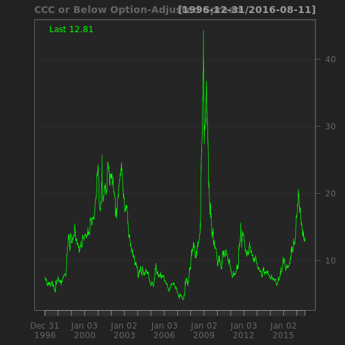


# interest rates #

Long-Term Government Bond Yields

## USA Treasury Inflation-Indexed Security ##


```
##                                                          
## "Min.   :-0.770  " "1st Qu.: 0.460  " "Median : 1.420  " 
##                                                          
## "Mean   : 1.185  " "3rd Qu.: 1.925  " "Max.   : 2.890  "
```

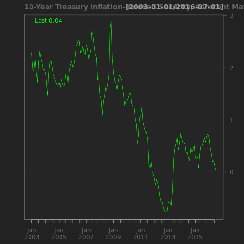

```
##                                                          
## "Min.   :-0.250  " "1st Qu.: 0.900  " "Median : 2.170  " 
##                                                          
## "Mean   : 2.085  " "3rd Qu.: 2.900  " "Max.   : 4.340  "
```

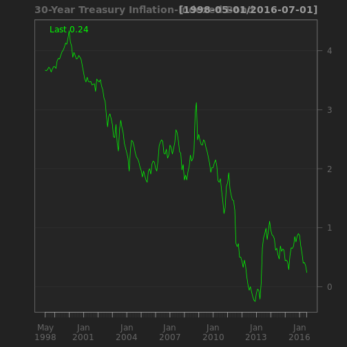

## 'Moody Seasoned Aaa Corporate Bond Yield ##

```
##                                                          
## "Min.   : 2.460  " "1st Qu.: 3.795  " "Median : 5.080  " 
##                                                          
## "Mean   : 5.798  " "3rd Qu.: 7.445  " "Max.   :15.490  "
```

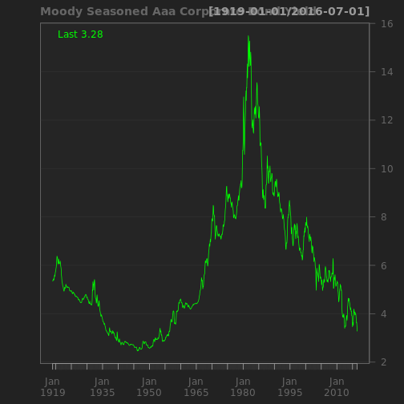

## Moody's Seasoned Aaa Corporate Bond Yield Relative to Yield on 10-Year Treasury Constant Maturity ##


```
##                                                             
## "Min.   :-0.1700  " "1st Qu.: 0.4200  " "Median : 0.8100  " 
##                                                             
## "Mean   : 0.9106  " "3rd Qu.: 1.3525  " "Max.   : 2.6800  "
```

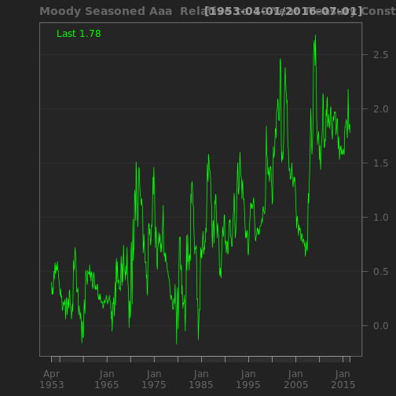


## Effective Federal Funds Rate ##


```
##                                                          
## "Min.   : 0.070  " "1st Qu.: 2.480  " "Median : 4.740  " 
##                                                          
## "Mean   : 4.952  " "3rd Qu.: 6.610  " "Max.   :19.100  "
```

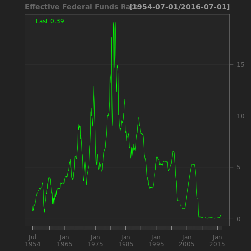


# stock markets #

1. historically stocks have returned between 6 and 7 percent after inflation over the last two centuries and have sold at an average PE ratio of about 15.


## s&p ##

of the top 20 firms,15 belongs to two industries: consumer staples and healthcare.


```
##                                                          
## "Min.   : 676.5  " "1st Qu.:1225.0  " "Median :1407.2  " 
##                                                          
## "Mean   :1484.7  " "3rd Qu.:1840.3  " "Max.   :2185.8  " 
##                    
##     "NA's   :92  "
```

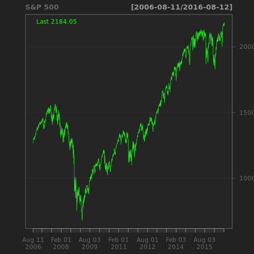


## Dow Jones Industrial Average ##


```
##                                                                         
## "Min.   : 6547  " "1st Qu.:11382  " "Median :12865  " "Mean   :13359  " 
##                                                       
## "3rd Qu.:16107  " "Max.   :18614  "    "NA's   :92  "
```

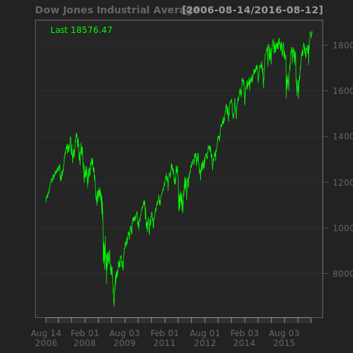

simpic.q('BCB/UDJIAD1','Dow Jones Industrial Average since 1896')


# real estate #

## USA home price ##


 

```
##                                                          
## "Min.   : 25.21  " "1st Qu.: 55.32  " "Median : 81.46  " 
##                                                          
## "Mean   : 97.08  " "3rd Qu.:143.60  " "Max.   :184.62  "
```

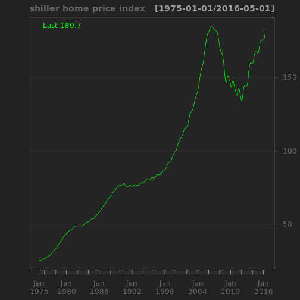
 Index Jan 2000=100

