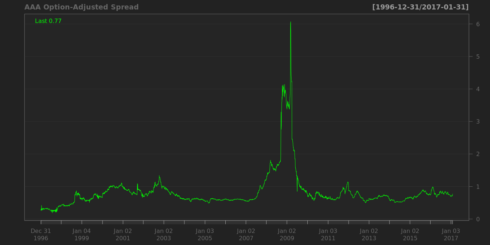

# 市场观测指标
qiufei  
2016-03-4  


# risk and volatility #

## St. Louis Fed Financial Stress Index ##


```
##                                                                   
## "Min.   :-1.659000  " "1st Qu.:-0.714000  " "Median : 0.095000  " 
##                                                                   
## "Mean   : 0.000022  " "3rd Qu.: 0.591000  " "Max.   : 5.662000  "
```


## CBOE volatility index ##

in the short run, there is a strong negative correlation between volatility index and the level of the market.


```
##                                                                         
## "Min.   : 9.31  " "1st Qu.:14.07  " "Median :17.89  " "Mean   :19.75  " 
##                                                       
## "3rd Qu.:23.14  " "Max.   :80.86  "   "NA's   :239  "
```


```
##                                                          
## "Min.   :  8.51  " "1st Qu.: 14.38  " "Median : 18.66  " 
##                                                          
## "Mean   : 20.58  " "3rd Qu.: 24.11  " "Max.   :150.19  " 
##                    
##    "NA's   :277  "
```


## BofA Merrill Lynch US Corporate AAA Option-Adjusted Spread ##


```
##                                                          
## "Min.   :0.1900  " "1st Qu.:0.6000  " "Median :0.7000  " 
##                                                          
## "Mean   :0.8336  " "3rd Qu.:0.8600  " "Max.   :6.0700  " 
##                    
##      "NA's   :5  "
```



## BofA Merrill Lynch US High Yield CCC or Below Option-Adjusted Spread ##


```
##                                                                         
## "Min.   : 4.14  " "1st Qu.: 7.68  " "Median :10.30  " "Mean   :11.84  " 
##                                                       
## "3rd Qu.:13.85  " "Max.   :44.29  "     "NA's   :5  "
```


# interest rates #

Long-Term Government Bond Yields

## USA Treasury Inflation-Indexed Security ##


```
##                                                          
## "Min.   :-0.770  " "1st Qu.: 0.460  " "Median : 1.420  " 
##                                                          
## "Mean   : 1.185  " "3rd Qu.: 1.925  " "Max.   : 2.890  "
```


```
##                                                          
## "Min.   :-0.250  " "1st Qu.: 0.900  " "Median : 2.170  " 
##                                                          
## "Mean   : 2.085  " "3rd Qu.: 2.900  " "Max.   : 4.340  "
```


## 'Moody Seasoned Aaa Corporate Bond Yield ##

```
##                                                          
## "Min.   : 2.460  " "1st Qu.: 3.795  " "Median : 5.080  " 
##                                                          
## "Mean   : 5.798  " "3rd Qu.: 7.445  " "Max.   :15.490  "
```


## Moody's Seasoned Aaa Corporate Bond Yield Relative to Yield on 10-Year Treasury Constant Maturity ##


```
##                                                             
## "Min.   :-0.1700  " "1st Qu.: 0.4200  " "Median : 0.8100  " 
##                                                             
## "Mean   : 0.9106  " "3rd Qu.: 1.3525  " "Max.   : 2.6800  "
```


## Effective Federal Funds Rate ##


```
##                                                          
## "Min.   : 0.070  " "1st Qu.: 2.480  " "Median : 4.740  " 
##                                                          
## "Mean   : 4.952  " "3rd Qu.: 6.610  " "Max.   :19.100  "
```


# stock markets #

1. historically stocks have returned between 6 and 7 percent after inflation over the last two centuries and have sold at an average PE ratio of about 15.


## s&p ##

of the top 20 firms,15 belongs to two industries: consumer staples and healthcare.


```
##                                                          
## "Min.   : 676.5  " "1st Qu.:1224.9  " "Median :1409.1  " 
##                                                          
## "Mean   :1486.9  " "3rd Qu.:1842.8  " "Max.   :2190.2  " 
##                    
##     "NA's   :92  "
```


## Dow Jones Industrial Average ##


```
##                                                                         
## "Min.   : 6547  " "1st Qu.:11387  " "Median :12878  " "Mean   :13376  " 
##                                                       
## "3rd Qu.:16153  " "Max.   :18636  "    "NA's   :92  "
```


simpic.q('BCB/UDJIAD1','Dow Jones Industrial Average since 1896')


# real estate #

## USA home price ##


 

```
##                                                          
## "Min.   : 25.21  " "1st Qu.: 55.32  " "Median : 81.46  " 
##                                                          
## "Mean   : 97.08  " "3rd Qu.:143.60  " "Max.   :184.62  "
```


 Index Jan 2000=100

