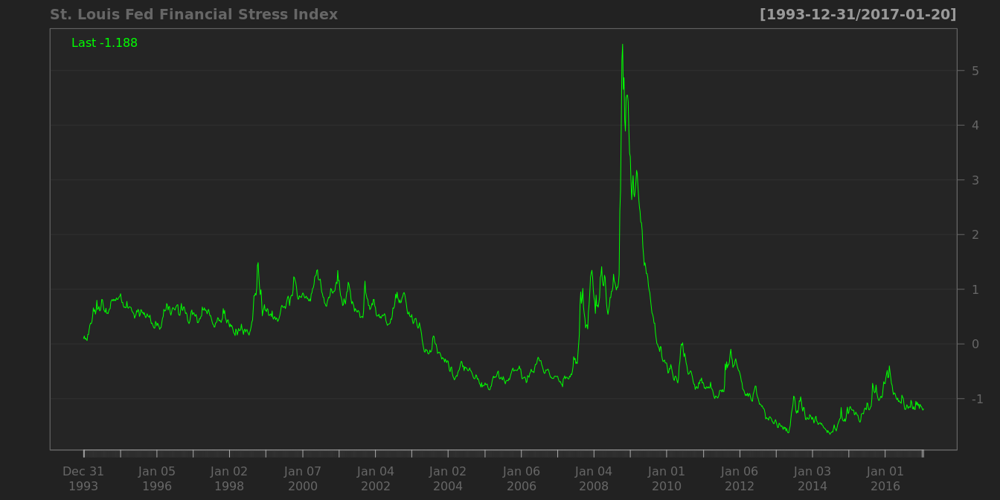
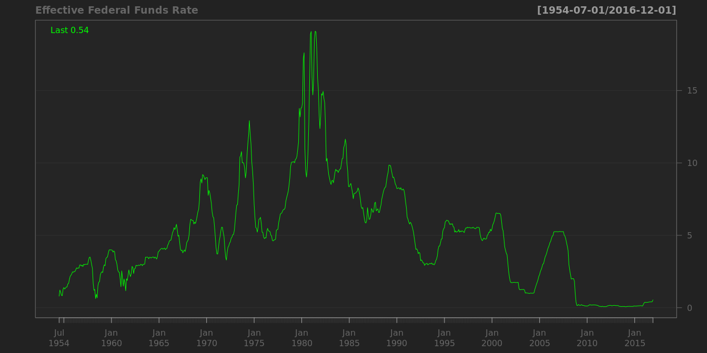
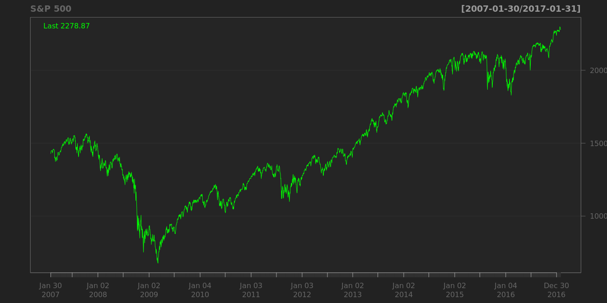

# 市场观测指标
qiufei  
2016-03-4  


# risk and volatility #

## St. Louis Fed Financial Stress Index ##


```
##                                                                   
## "Min.   :-1.651000  " "1st Qu.:-0.726000  " "Median : 0.089000  " 
##                                                                   
## "Mean   : 0.000006  " "3rd Qu.: 0.561000  " "Max.   : 5.767000  "
```




## CBOE volatility index ##

in the short run, there is a strong negative correlation between volatility index and the level of the market.


```
##                                                                         
## "Min.   : 9.31  " "1st Qu.:14.12  " "Median :17.98  " "Mean   :19.80  " 
##                                                       
## "3rd Qu.:23.20  " "Max.   :80.86  "   "NA's   :237  "
```


```
##                                                          
## "Min.   :  8.51  " "1st Qu.: 14.45  " "Median : 18.74  " 
##                                                          
## "Mean   : 20.64  " "3rd Qu.: 24.18  " "Max.   :150.19  " 
##                    
##    "NA's   :275  "
```


## BofA Merrill Lynch US Corporate AAA Option-Adjusted Spread ##


```
##                                                          
## "Min.   :0.1900  " "1st Qu.:0.6000  " "Median :0.6900  " 
##                                                          
## "Mean   :0.8341  " "3rd Qu.:0.8600  " "Max.   :6.0700  "
```


## BofA Merrill Lynch US High Yield CCC or Below Option-Adjusted Spread ##


```
##                                                                         
## "Min.   : 4.14  " "1st Qu.: 7.65  " "Median :10.18  " "Mean   :11.82  " 
##                                     
## "3rd Qu.:13.81  " "Max.   :44.29  "
```


# interest rates #

Long-Term Government Bond Yields

## USA Treasury Inflation-Indexed Security ##


```
##                                                             
## "Min.   :-0.7700  " "1st Qu.: 0.4925  " "Median : 1.4650  " 
##                                                             
## "Mean   : 1.2047  " "3rd Qu.: 1.9400  " "Max.   : 2.8900  "
```


```
##                                                             
## "Min.   :-0.2500  " "1st Qu.: 0.9575  " "Median : 2.1800  " 
##                                                             
## "Mean   : 2.1089  " "3rd Qu.: 2.9150  " "Max.   : 4.3400  "
```


## 'Moody Seasoned Aaa Corporate Bond Yield ##

```
##                                                          
## "Min.   : 2.460  " "1st Qu.: 3.808  " "Median : 5.085  " 
##                                                          
## "Mean   : 5.804  " "3rd Qu.: 7.450  " "Max.   :15.490  "
```


## Moody's Seasoned Aaa Corporate Bond Yield Relative to Yield on 10-Year Treasury Constant Maturity ##


```
##                                                             
## "Min.   :-0.1700  " "1st Qu.: 0.4200  " "Median : 0.8100  " 
##                                                             
## "Mean   : 0.9069  " "3rd Qu.: 1.3400  " "Max.   : 2.6800  "
```


## Effective Federal Funds Rate ##


```
##                                                          
## "Min.   : 0.070  " "1st Qu.: 2.500  " "Median : 4.750  " 
##                                                          
## "Mean   : 4.971  " "3rd Qu.: 6.610  " "Max.   :19.100  "
```




# stock markets #

1. historically stocks have returned between 6 and 7 percent after inflation over the last two centuries and have sold at an average PE ratio of about 15.


## s&p ##

of the top 20 firms,15 belongs to two industries: consumer staples and healthcare.


```
##                                                          
## "Min.   : 676.5  " "1st Qu.:1224.6  " "Median :1394.3  " 
##                                                          
## "Mean   :1463.5  " "3rd Qu.:1770.5  " "Max.   :2130.8  " 
##                    
##     "NA's   :92  "
```




## Dow Jones Industrial Average ##


```
##                                                                         
## "Min.   : 6547  " "1st Qu.:11204  " "Median :12724  " "Mean   :13184  " 
##                                                       
## "3rd Qu.:15663  " "Max.   :18312  "    "NA's   :92  "
```


simpic.q('BCB/UDJIAD1','Dow Jones Industrial Average since 1896')


# real estate #

## USA home price ##


 

```
##                                                          
## "Min.   : 25.22  " "1st Qu.: 55.01  " "Median : 81.44  " 
##                                                          
## "Mean   : 96.58  " "3rd Qu.:143.10  " "Max.   :184.62  "
```


 Index Jan 2000=100

