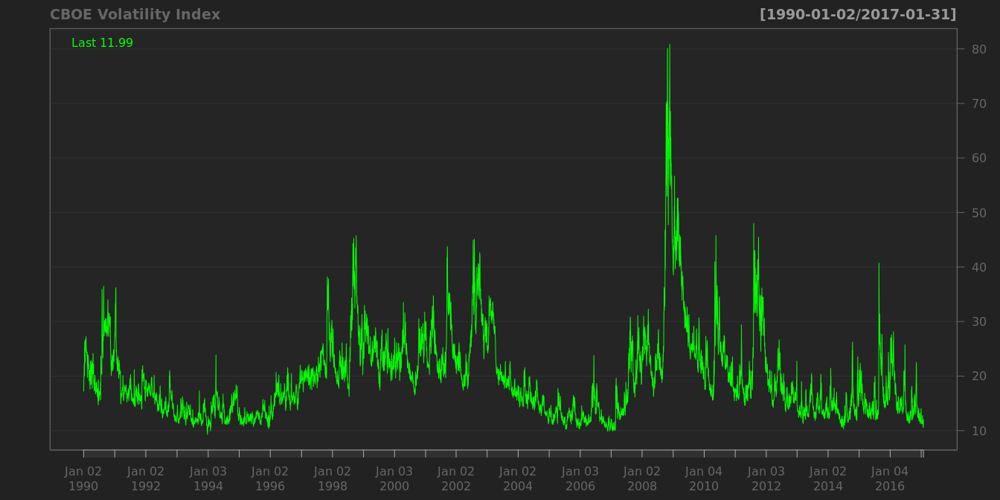
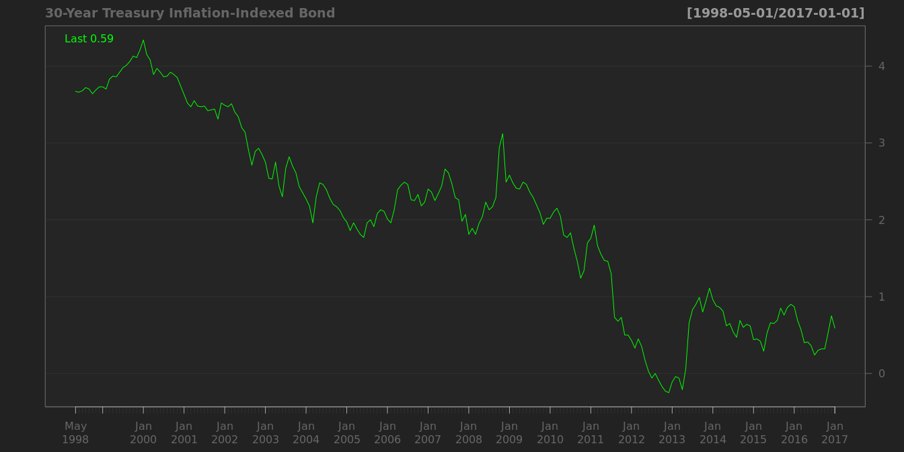
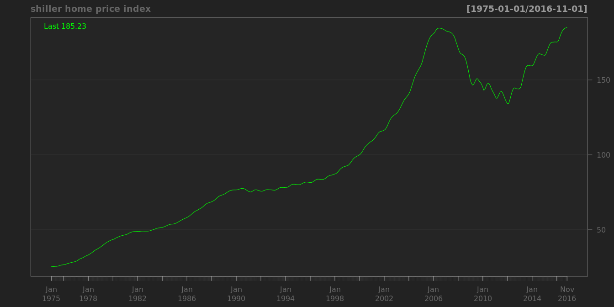

# 市场观测指标
qiufei  
2016-03-4  


# risk and volatility #

## St. Louis Fed Financial Stress Index ##


```
##                                                                   
## "Min.   :-1.660000  " "1st Qu.:-0.722250  " "Median : 0.077500  " 
##                                                                   
## "Mean   : 0.000006  " "3rd Qu.: 0.621750  " "Max.   : 5.572000  "
```


## CBOE volatility index ##

in the short run, there is a strong negative correlation between volatility index and the level of the market.


```
##                                                                         
## "Min.   : 9.31  " "1st Qu.:14.04  " "Median :17.85  " "Mean   :19.72  " 
##                                                       
## "3rd Qu.:23.09  " "Max.   :80.86  "   "NA's   :240  "
```



```
##                                                          
## "Min.   :  8.51  " "1st Qu.: 14.35  " "Median : 18.62  " 
##                                                          
## "Mean   : 20.54  " "3rd Qu.: 24.08  " "Max.   :150.19  " 
##                    
##    "NA's   :278  "
```


## BofA Merrill Lynch US Corporate AAA Option-Adjusted Spread ##


```
##                                                          
## "Min.   :0.1900  " "1st Qu.:0.6000  " "Median :0.7000  " 
##                                                          
## "Mean   :0.8334  " "3rd Qu.:0.8600  " "Max.   :6.0700  " 
##                    
##      "NA's   :5  "
```


## BofA Merrill Lynch US High Yield CCC or Below Option-Adjusted Spread ##


```
##                                                                         
## "Min.   : 4.14  " "1st Qu.: 7.69  " "Median :10.38  " "Mean   :11.84  " 
##                                                       
## "3rd Qu.:13.82  " "Max.   :44.29  "     "NA's   :5  "
```


# interest rates #

Long-Term Government Bond Yields

## USA Treasury Inflation-Indexed Security ##


```
##                                                          
## "Min.   :-0.770  " "1st Qu.: 0.450  " "Median : 1.410  " 
##                                                          
## "Mean   : 1.172  " "3rd Qu.: 1.910  " "Max.   : 2.890  "
```


```
##                                                          
## "Min.   :-0.250  " "1st Qu.: 0.880  " "Median : 2.170  " 
##                                                          
## "Mean   : 2.069  " "3rd Qu.: 2.890  " "Max.   : 4.340  "
```



## 'Moody Seasoned Aaa Corporate Bond Yield ##

```
##                                                          
## "Min.   : 2.460  " "1st Qu.: 3.770  " "Median : 5.080  " 
##                                                          
## "Mean   : 5.794  " "3rd Qu.: 7.440  " "Max.   :15.490  "
```


## Moody's Seasoned Aaa Corporate Bond Yield Relative to Yield on 10-Year Treasury Constant Maturity ##


```
##                                                             
## "Min.   :-0.1700  " "1st Qu.: 0.4200  " "Median : 0.8100  " 
##                                                             
## "Mean   : 0.9128  " "3rd Qu.: 1.3600  " "Max.   : 2.6800  "
```


## Effective Federal Funds Rate ##


```
##                                                          
## "Min.   : 0.070  " "1st Qu.: 2.475  " "Median : 4.730  " 
##                                                          
## "Mean   : 4.940  " "3rd Qu.: 6.595  " "Max.   :19.100  "
```


# stock markets #

1. historically stocks have returned between 6 and 7 percent after inflation over the last two centuries and have sold at an average PE ratio of about 15.


## s&p ##

of the top 20 firms,15 belongs to two industries: consumer staples and healthcare.


```
##                                                          
## "Min.   : 676.5  " "1st Qu.:1224.9  " "Median :1416.2  " 
##                                                          
## "Mean   :1500.5  " "3rd Qu.:1871.6  " "Max.   :2190.2  " 
##                    
##     "NA's   :92  "
```


## Dow Jones Industrial Average ##


```
##                                                                         
## "Min.   : 6547  " "1st Qu.:11411  " "Median :12981  " "Mean   :13485  " 
##                                                       
## "3rd Qu.:16335  " "Max.   :18636  "    "NA's   :92  "
```


simpic.q('BCB/UDJIAD1','Dow Jones Industrial Average since 1896')


# real estate #

## USA home price ##


 

```
##                                                          
## "Min.   : 25.25  " "1st Qu.: 55.52  " "Median : 81.54  " 
##                                                          
## "Mean   : 97.42  " "3rd Qu.:143.96  " "Max.   :184.62  "
```


 Index Jan 2000=100

