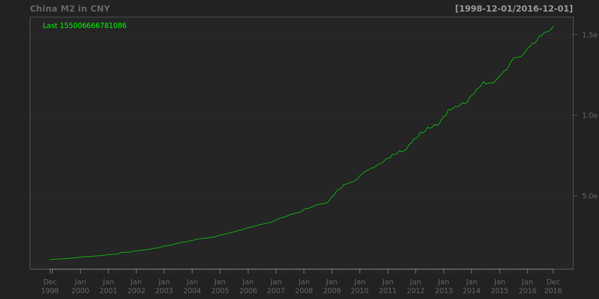
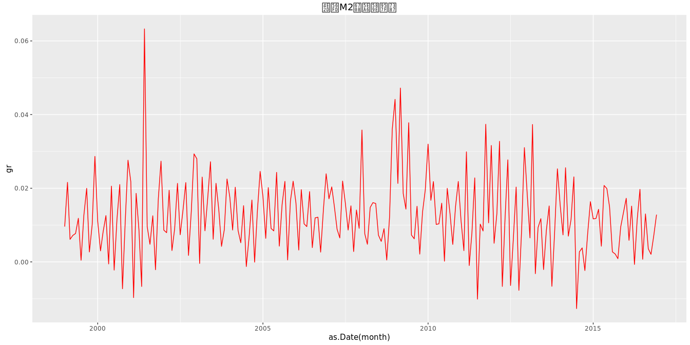
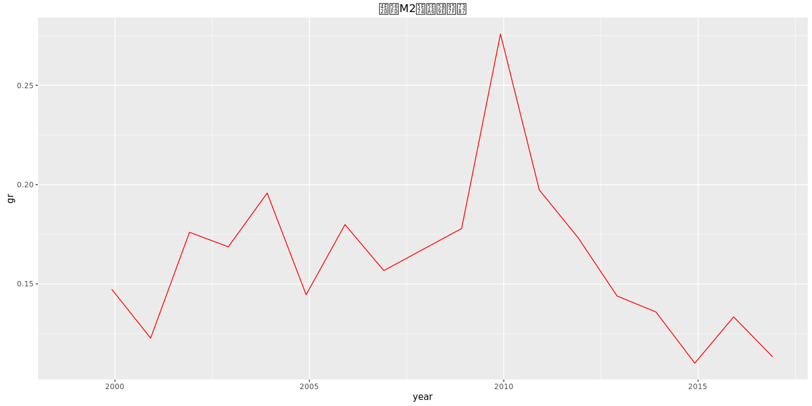

# 金融
qiufei  
2016-03-04  


# M2 for China

Monthly, Not Seasonally Adjusted

## get data from fred




## M2 growth rate--month and year



```
##      Min.   1st Qu.    Median      Mean   3rd Qu.      Max.      NA's 
## -0.012680  0.006366  0.011740  0.012830  0.019490  0.063260         1
```

```
## [1] 0.01514746
```



```
##    Min. 1st Qu.  Median    Mean 3rd Qu.    Max.    NA's 
##  0.1101  0.1439  0.1673  0.1651  0.1779  0.2758       1
```

```
## [1] 0.133431
```

# m0,m1,m2


          M2g                 M1g                 M0g          
---  ------------------  ------------------  ------------------
     Min.   :-0.012680   Min.   :-0.068440   Min.   :-0.185893 
     1st Qu.: 0.006423   1st Qu.: 0.001115   1st Qu.:-0.019541 
     Median : 0.011741   Median : 0.012182   Median : 0.009420 
     Mean   : 0.012941   Mean   : 0.011393   Mean   : 0.009073 
     3rd Qu.: 0.018832   3rd Qu.: 0.026910   3rd Qu.: 0.028831 
     Max.   : 0.047204   Max.   : 0.062543   Max.   : 0.305836 
     NA's   :1           NA's   :1           NA's   :1         


